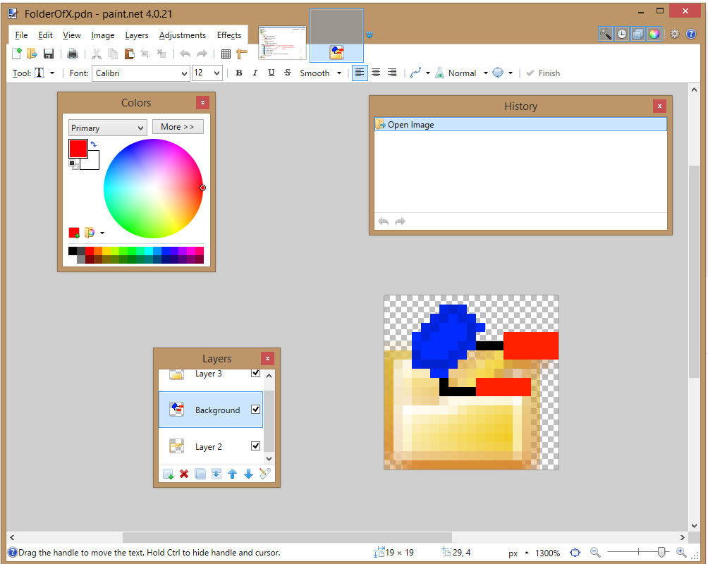
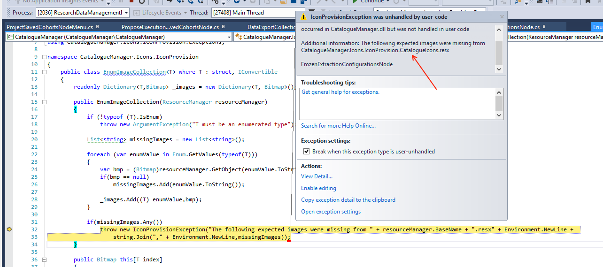
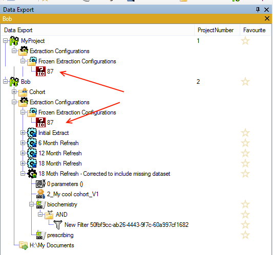

# Table of contents
1. [Background](#background)
1. [Tools](#tools)
1. [Create the icon](#createIcon)
2. [Writing the node class](#nodeClass)
3. [Adding the node to the tree](#addToTree)
4. [Adding children with AddChildren method](#addChildren)
<a name="background"></a>
# Background
The RDMP displays almost all the persistent objects  (Projects, Cohorts, Extraction Configurations etc) in various tree views `CatalogueManager.Collections.RDMPCollectionUI`.  In this tutorial we will look at making a code change to the tree structure.

At the time of writing this tutorial, all `ExtractionConfiguration` () in a `Project` ()appear in a single `ExtractionConfigurationsNode` folder ().  This means that over time a Project can accrue a considerable number of configurations and it can be difficult to see the active one.  RDMP lets you freeze old Extraction Configurations but they are still visible in the tree. We want to add a new node under the `ExtractionConfigurationsNode` () in which to store all the frozen configurations.

 

<a name="tools"></a>
# Tools
In this tutorial we will use the following tools:
1. Paint.Net
2. Visual Studio
3. ReSharper

Feel free to substitute in alternate tooling

<a name="createIcon"></a>
# Creating The Icon
Go to the root directory of your RDMP checkout and open `\CatalogueManager\CatalogueManager\Icons\FolderOfX.pdn` and select the middle Layer 'Background'.  Copy in the new icon and resize it to look nice.

 

 Save the new image as a 19x19 png with the name of the class you intend to use (think about this before you save it!) e.g. `FrozenExtractionConfigurationsNode.png`.  When naming you should use the suffix Node for any class which is not directly tied to a a database persistence object.  For example Project inherits from `DatabaseEntity` and is a persistent object but anything which is created arbitrarily at runtime or is a container of other items should be called a Node.

<a name="addIcon"></a>
# Adding the icon to the project
RDMP requires that all tree view objects have an entry in RDMPConcept Enum, a class with the same name and a .png icon file with the same name.  So the first step is to open RDMPConcept and add a new Enum value `FrozenExtractionConfigurationsNode`
 

Next add a class 'FrozenExtractionConfigurationsNode.cs' (leave this empty for now).  This class should appear in one of the `Nodes` folders if it is a node.  If you are creating an icon for a `DatabaseEntity` then you will already have your class implemented and tested so you can skip this stage (You still need the RDMPConcept though).

It is worth launching RDMP at this point to see the error that occurs when you have an Enum value in `RDMPConcept` that doesn't have an associated png (we have created it but not added it to the resources file yet)
 

Open CatalogueIcons.resx and add your image.

 

<a name="nodeClass"></a>
# Writing the node class
In the previous section we created a class `FrozenExtractionConfigurationsNode` (or whatever your node is called) which we left empty.  Ensure the name of this class exactly matches (including capitalisation) the png file and an `RDMPConcept` Enum value.  Now we will write the code that makes the node behave correctly.

Start out by overriding the ToString method to return the text you want to appear in the tree view.

```csharp
namespace DataExportManager.Collections.Nodes
{
    class FrozenExtractionConfigurationsNode
    {
        public override string ToString()
        {
            return "Frozen Extraction Configurations";
        }
    }
} 
```

NOTE: If a node can only ever appear once in any collection (e.g. it is a unique top level node) then you can instead inherit from SingletonNode and skip the rest of this section.  If you are an SingletonNode then your class name should start with All e.g. AllCakesNode, AllCarsNode etc.

Assuming you dont have a SingletonNode then you should add constructor arguments sufficient to uniquely identify which instance you have.  In this case we will have an `FrozenExtractionConfigurationsNode` instance for every `Project` so we need a reference to which `Project` we relate to.

```csharp
class FrozenExtractionConfigurationsNode
   {
       public Project Project { get; set; }

       public FrozenExtractionConfigurationsNode(Project project)
       {
           Project = project;
       }

       public override string ToString()
       {
           return "Frozen Extraction Configurations";
       }
   }
```

Finally we need to implement 'Equality members', this ensures that Object List View (the library behind the tree control) knows when two Nodes of the same Type are the same and when they are different (and for HashCode etc).  The easiest way to do this is with ReSharper and Alt+Ins (by default).

```csharp
class FrozenExtractionConfigurationsNode
{
	public Project Project { get; set; }

	public FrozenExtractionConfigurationsNode(Project project)
	{
		Project = project;
	}

	public override string ToString()
	{
		return "Frozen Extraction Configurations";
	}

	protected bool Equals(FrozenExtractionConfigurationsNode other)
	{
		return Equals(Project, other.Project);
	}

	public override bool Equals(object obj)
	{
		if (ReferenceEquals(null, obj)) return false;
		if (ReferenceEquals(this, obj)) return true;
		if (obj.GetType() != this.GetType()) return false;
		return Equals((FrozenExtractionConfigurationsNode) obj);
	}

	public override int GetHashCode()
	{
		return (Project != null ? Project.GetHashCode() : 0);
	}
}
```

<a name="addToTree"></a>
# Adding the node to the tree
Finally we can add instances of the node class to the tree.  This is done through the `CatalogueLibrary.Providers.IChildProvider`.  Open  `DataExportManager.Collections.Providers.DataExportChildProvider` and `CatalogueLibrary.Providers.CatalogueChildProvider` and identify the method which adds children for your parent object.  It will be called `AddChildren` and take a first parameter of the Type you want to add children to.  In this example we want to add the child node to the class `ExtractionConfigurationsNode` ().  So we search for '`AddChildren(ExtractionConfigurationsNode`'

 

If you are adding your node to a class that doesn't have any children yet (and therefore doesn't have an `AddChildren` method declared for it) then you will need to find the constructor calls for your chosen parent and add create an `AddChildren` method for it (See [Adding Children with AddChildren method](#addChildren) below for how to do this).

Create a new instance of your node class and add it to the children HashSet declared in the AddChildren method.

```csharp
var frozenConfigurationsNode = new FrozenExtractionConfigurationsNode(extractionConfigurationsNode.Project);
children.Add(frozenConfigurationsNode);
```

The full method should now look something like:
```csharp
private void AddChildren(ExtractionConfigurationsNode extractionConfigurationsNode, DescendancyList descendancy)
        {
            HashSet<object> children = new HashSet<object>();

            var frozenConfigurationsNode = new FrozenExtractionConfigurationsNode(extractionConfigurationsNode.Project);
            children.Add(frozenConfigurationsNode);

            var configs = ExtractionConfigurations.Where(c => c.Project_ID == extractionConfigurationsNode.Project.ID).ToArray();
            foreach (ExtractionConfiguration config in configs)
            {
                AddChildren(config, descendancy.Add(config));
                children.Add(config);
            }

            AddToDictionaries(children, descendancy);
        }
```

Run RDMP and your new node should now appear.

 
<a name="addChildren"></a>

# Adding Children with an `AddChildren` method
All AddChildren methods have the same basic structure:
```csharp
private void AddChildren(SomeType someTypeInstance, DescendancyList descendancy)
{
	//Create new children Hashset
	
	//Add children objects
	
	//Call AddToDictionaries
}
```

A `DescendancyList` is a list of all the parent objects for a given object and is core for allowing RDMP to tie tabs to objects, handle refreshing, finding etc.

When calling an `AddChildren` method it is vital you pass both parent object and the correct DescendancyList.  Fortunately this is almost always just:

```
AddChildren(someObject, descendancy.Add(someObject));
```

Add the above line after your nodes constructor has been invoked e.g.

```csharp

//Create a node instance
var frozenConfigurationsNode = new FrozenExtractionConfigurationsNode(extractionConfigurationsNode.Project);

//Make the node appear under the extractionConfigurationsNode
children.Add(frozenConfigurationsNode);

//Add children to the frozen folder
AddChildren(frozenConfigurationsNode,descendancy.Add(frozenConfigurationsNode));

```

This will give you a compiler error because there is not yet an AddChildren overload for your node.  Create a new overload of AddChildren

```csharp
private void AddChildren(FrozenExtractionConfigurationsNode frozenExtractionConfigurationsNode, DescendancyList descendancy)
{
	throw new NotImplementedException();
}
```

In this method add the following:
```csharp
  private void AddChildren(FrozenExtractionConfigurationsNode frozenExtractionConfigurationsNode, DescendancyList descendancy)
	{
		HashSet<object> children = new HashSet<object>();

		//todo add child objects here

		AddToDictionaries(children,descendancy);
	}
```

Now add new objects to the children hashset that you want to appear under your node.

Just as an example add the number 87 to the children HashSet:

```csharp
  private void AddChildren(FrozenExtractionConfigurationsNode frozenExtractionConfigurationsNode, DescendancyList descendancy)
{
	HashSet<object> children = new HashSet<object>();

	children.Add(87);

	AddToDictionaries(children,descendancy);
}
```

 

Firstly notice how we get a missing icon appearing.  This is because there is no RDMPConcept or icon associated with int (unsurprisingly!).  Secondly notice that the tree hierarchy is looking dodgy.  This is because the same object (87) is appearing in the hierarchy twice which is a big no no.

To complete this example we will modify the `AddChildren` method for `ExtractionConfigurationsNode` so that it no longer shows Frozen configurations and modify the new one to only show Frozen configurations.

```csharp
private void AddChildren(ExtractionConfigurationsNode extractionConfigurationsNode, DescendancyList descendancy)
{
	HashSet<object> children = new HashSet<object>();

	//Create a frozen extraction configurations folder as a subfolder of each ExtractionConfigurationsNode
	var frozenConfigurationsNode = new FrozenExtractionConfigurationsNode(extractionConfigurationsNode.Project);

	//Make the frozen folder appear under the extractionConfigurationsNode
	children.Add(frozenConfigurationsNode);

	//Add children to the frozen folder
	AddChildren(frozenConfigurationsNode,descendancy.Add(frozenConfigurationsNode));

	//Add ExtractionConfigurations which are not released (frozen)
	var configs = ExtractionConfigurations.Where(c => c.Project_ID == extractionConfigurationsNode.Project.ID).ToArray();
	foreach (ExtractionConfiguration config in configs.Where(c=>!c.IsReleased))
	{
		AddChildren(config, descendancy.Add(config));
		children.Add(config);
	}

	AddToDictionaries(children, descendancy);
}

private void AddChildren(FrozenExtractionConfigurationsNode frozenExtractionConfigurationsNode, DescendancyList descendancy)
{
	HashSet<object> children = new HashSet<object>();

	//Add ExtractionConfigurations which are not released (frozen)
	var configs = ExtractionConfigurations.Where(c => c.Project_ID == frozenExtractionConfigurationsNode.Project.ID).ToArray();
	foreach (ExtractionConfiguration config in configs.Where(c => c.IsReleased))
	{
		AddChildren(config, descendancy.Add(config));
		children.Add(config);
	}

	AddToDictionaries(children,descendancy);
}
```
Now when you run RDMP, the final tree should look something like:

 