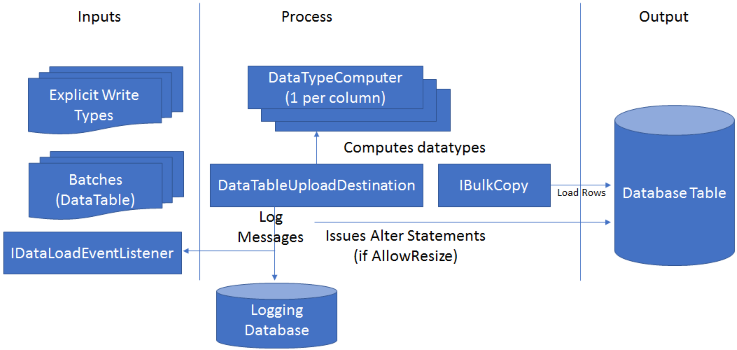
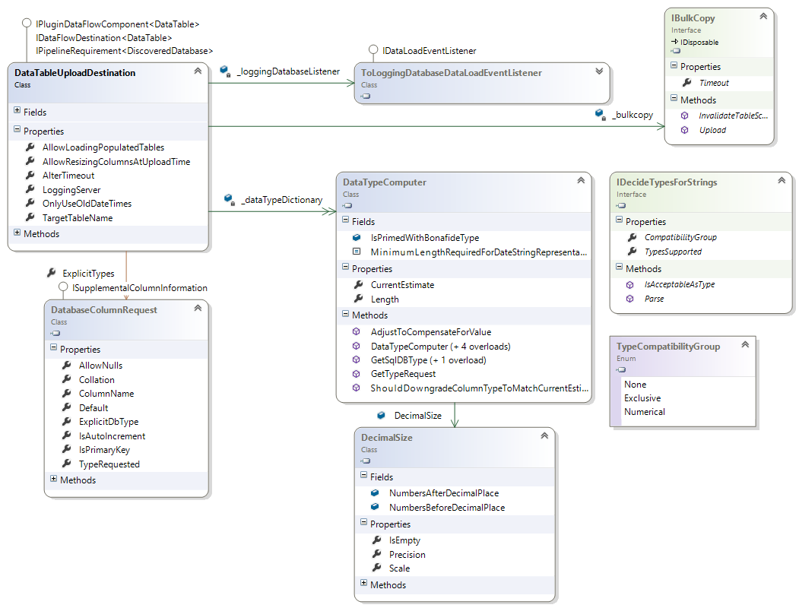

# Data Table Upload

## Table of contents
1. [Background](#background)
2. [Settings](#settings)
3. [Behaviour](#behaviour)
4. [Resizing](#resizing)
4. [Primary Keys](#primary-keys)
4. [Tests](#tests)
4. [Class Diagram](#class-diagram)

## Background
A large part of the functionality in RDMP is concerned with the moving of data into databases (e.g. out of CSV files, caching the results of cohort identification queries).  Sometimes this involves creating new tables on the fly with a schema appropriate to the data being loaded.  

Sometimes the data types are not known and often it is not possible to hold all the data in memory (e.g. bulk inserting an 80GB flat file).  Even when data types are known e.g. `System.Float` it is often necessary to determine further information (e.g. number of decimal places to declare database scale and precision).

The component responsible for pushing data in memory into the database is `DataTableUploadDestination`.

 

## Settings
The behaviour of `DataTableUploadDestination` is controlled through settings such as `AllowResizingColumnsAtUploadTime`, `AllowLoadingPopulatedTables`, `LoggingServer` etc.  These settings are documented in the class / user interface.

## Behaviour
When the first DataTable is passed into `DataTableUploadDestination` a new `DataTypeComputer` will be created for each column.  Every cell value is then fed through these computers.  This will record the maximum decimal size seen, the longest string and make a guess at the Type (if the data is not hard typed already).  The determination of data type is handled by implementations of `IDecideTypesForStrings`.  Each allowable `Type` has a `TypeCompatibilityGroup`, this determines the behaviour of the system when mixed values are encountered e.g. "1" (int) followed by "1.1" (decimal).  If the Types are compatible then the `CurrentEstimate` will be the Type that accomodates both values (e.g. decimal).  If values are not compatible (e.g. "1" followed by "2001-01-01") then the `CurrentEstimate` will be changed to string (varchar).

Sometimes you want to force a specific destination database datatype for some/all columns.  This can be done either by setting `ExplicitTypes` or by creating the table yourself before running the `DataTableUploadDestination`. These types are the initial estimates and can be changed based on data encountered (unless you turn off `AllowResizingColumnsAtUploadTime`).

Once all data types have been determined the destination table is created with the appropriate schema.

If a column is always null then the column estimate will be `Boolean` (`bit`).

## Resizing
Data is loaded into tables in batches using an appropriate `IBulkCopy` for the DBMS being targetted (e.g. Sql Server, MySql).  Each batch goes through the `DataTypeComputer` which can result in a column estimate changing.  When this occurs (assuming `AllowResizingColumnsAtUploadTime`) then an ALTER statement is issued to change the column to the new `Type`.

## Primary Keys
The table created will have an appropriate primary key if the `DataTable` batches supplied have a PrimaryKey set or if any `ExplicitTypes` columns have `IsPrimaryKey` set.  This key will only be created when the `DataTableUploadDestination` is disposed since primary keys can affect the ability to issue ALTER statements.

## Tests
See `Rdmp.Core.Tests.DataLoad.Engine.Integration.DataTableUploadDestinationTests`.

## Class Diagram
