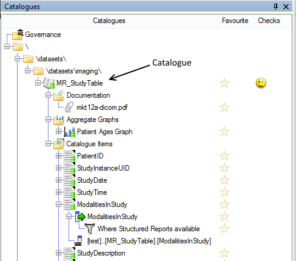
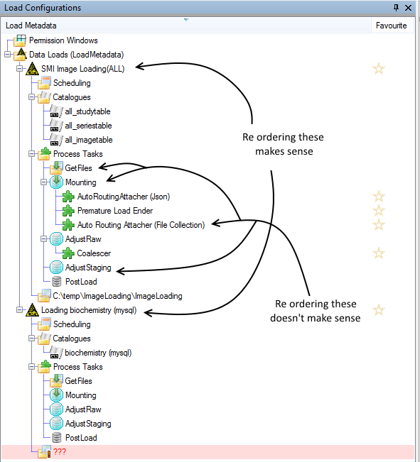
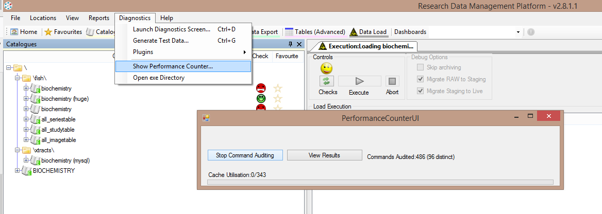
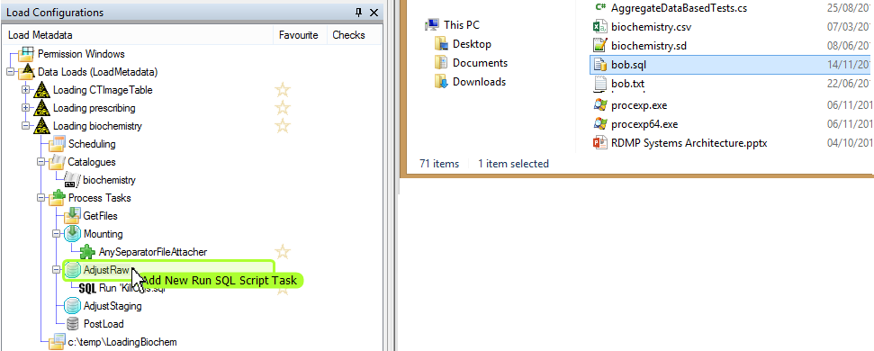

# Frequently Asked Questions
## Table of contents
1. [Can RDMP Load UnTyped Data?](#untyped)
1. [How does RDMP deal with Csv/text files?](#csv)
1. [How does RDMP handle / translate untyped, C# and Database Types](#typetranslation)
1. [What is a Catalogue?](#whatisacatalogue)
1. [How do I stop some nodes being reordered in RDMPCollectionUIs?](#reorder)
2. [How do I add new nodes to RDMPCollectionUIs?](#addNewNodes)
3. [How do platform databases / database objects work?](#databaseObjects)
3. [When I connect to MySql it says 'The host localhost does not support SSL connections'](#disableSSL)
3. [How do I set a custom port / SSL certificate / connection string option?](#connectionStringKeywords)
4. [My metadata databases are being hammered by thousands of requests](#databaseDdos)
5. [How does RDMP handle untyped input (e.g. csv)?](#dataTypeComputer)
6. [Does RDMP Support Plugins?](#plugins)
7. [Are there Unit/Integration Tests?](#tests)
8. [When loading data can I skip some columns?](#skipColumns)
9. [Can I run SQL Scripts during a load?](#sqlScripts)

<a name="untyped"></a>
### Can RDMP Load UnTyped Data?
Yes, [determining database types from untyped data (e.g. CSV)](./DataTableUpload.md) is a core feature.

<a name="csv"></a>
### How does RDMP deal with Csv/text files?
RDMP supports files delimited by any character (tab separated, pipe separated, comma separated etc).  Since [invalid formatting is a common problem with ETL of CSV files RDMP has several fault tolernace features](./CSVHandling.md).

<a name="typetranslation"></a>
### How does RDMP handle / translate untyped, C# and Database Types?
The [TypeTranslation namespace handles this](./TypeTranslation.md).

<a name="whatisacatalogue"></a>
### What is a Catalogue?
A Catalogue is RDMP's representation of one of your datasets e.g. 'Hospital Admissions'.  A Catalogue consists of:

* Human readable names/descriptions of what is in the dataset it is
* A collection of items mapped to underlying columns in your database.  Each of these:
	* Can be extractable or not, or extractable only with SpecialApproval
	* Can involve a transform on the underlying column (E.g. hash on extraction, UPPER etc)
	* Have a human readable name/description of the column/transform
	* Can have curated WHERE filters defined on them which can be reused for project extraction/cohort generation etc
* Validation rules for each of the extractable items in the dataset
* Graph definitions for viewing the contents of the dataset (and testing filters / cohorts built)
* Attachments which help understand the dataset (e.g. a pdf file)




A Catalogue can be a part of project extraction configurations, used in cohort identification configurations.  They can be marked as Deprecated, Internal etc.

The separation of dataset and underlying table allows you to have multiple datasets both of which draw data from the same table.  It also makes it easier to handle moving a table/database (e.g. to a new server or database) / renaming etc.

Internally Catalogues are stored in the Catalogue table of the RDMP platform database (e.g. RDMP_Catalogue).  The ID field of this table is used by other objects to reference it (e.g. CatalogueItem.Catalogue_ID).  

<a name="reorder"></a>
### How do I stop some nodes being reordered in RDMPCollectionUIs?
Sometimes you want to limit which nodes in an `RDMPCollectionUI` are reordered when the user clicks on the column header.  In the below picture we want to allow the user to sort data loads by name but we don't want to reorder the ProcessTask nodes or the steps in them since that would confuse the user as to the execution order.

 

You can prevent all nodes of a given Type from being reordered (relative to their branch siblings) by inheriting `IOrderable` and returning an appropriate value:

```csharp
public class ExampleNode : IOrderable
{
	public int Order { get { return 2; } set {} }
}
```

If you are unsure what Type a given node is you can right click it and select 'What Is This?'.

<a name="addNewNodes"></a>
### How do I add new nodes to RDMPCollectionUIs?
This requires a tutorial all of it's own 

https://github.com/HicServices/RDMP/blob/develop/Documentation/CodeTutorials/CreatingANewCollectionTreeNode.md


<a name="databaseObjects"></a>
### How do platform databases / database objects work?

See `DataStructures.cd` (todo: How about a README.md - Ed)

<a name="disableSSL"></a>
### When I connect to MySql it says 'The host localhost does not support SSL connections'
If your MySql server does not support SSL connections then you can specify a [Connection String Keyword](#connectionStringKeywords) 'SSLMode' with the Value 'None' (Make sure you select DatabaseType:MySQLServer)


<a name="connectionStringKeywords"></a>
### How do I set a custom port / SSL certificate / connection string option?
RDMP manages connection strings internally.  If you want a keyword applied on your connection strings you can add it in the 'Connection String Keywords' node.  Each keyword is associated with a single database provider (MySql, Oracle etc).  In order for the changes to take effect you will need to restart RDMP.


<a name="databaseDdos"></a>
### My metadata databases are being hammered by thousands of requests?
The entire RDMP meta data model is stored in platform databases (Catalogue / Data Export etc).  Classes e.g. `Catalogue` are fetched either all at once or by `ID`.  The class Properties can be used to fetch other related objects e.g. `Catalogue.CatalogueItems`.  This usually does not result in a bottleneck but under some conditions deeply nested use of these properties can result in your platform database being hammered with requests.  You can determine whether this is the case by using the PerformanceCounter.  This tool will show every database request issued while it is running including the number of distinct Stack Frames responsible for the query being issued.  Hundreds or even thousands of requests isn't a problem but if you start getting into the tens of thousands for trivial operations you might want to refactor your code.

 

Typically you can solve these problems by fetching all the required objects up front e.g.

```csharp
var catalogues = repository.GetAllObjects<Catalogue>();
var catalogueItems = repository.GetAllObjects<CatalogueItem>();
```

If you think the problem is more widespread then you can also use the `IInjectKnown<T>` system to perform `Lazy` loads which prevents repeated calls to the same property going back to the database every time.

https://github.com/HicServices/RDMP/blob/develop/Reusable/MapsDirectlyToDatabaseTable/Injection/README.md

<a name="dataTypeComputer"></a>
### How does RDMP handle untyped input (e.g. csv)?

RDMP computes the data types required for untyped input as a `DataTypeRequest` using the `DataTypeComputer` class.  For full details see:

https://github.com/HicServices/RDMP/tree/develop/Reusable/ReusableLibraryCode/DatabaseHelpers/Discovery/TypeTranslation/README.md

<a name="plugins"></a>
### Does RDMP Support Plugins?
Yes, RDMP supports both functional plugins (e.g. new anonymisation components, new load plugins etc) as well as UI plugins (e.g. new operations when you right click a `Catalogue`).

https://github.com/HicServices/RDMP/blob/develop/Documentation/CodeTutorials/PluginWriting.md

<a name="tests"></a>
### Are there Unit/Integration Tests?
Yes there are over 1,000 unit and integration tests, this is covered in [Tests](Tests.md)

<a name="skipColumns"></a>
### When loading data can I skip some columns?
The data load engine first loads all data to the temporary unconstrained RAW database then migrates it to STAGING and finally merges it with LIVE (See [UserManual.docx](../UserManual.docx) for more info).  It is designed to make it easy to identify common issues such as data providers renaming columns, adding new columns etc.


The above message shows the case where there is a new column appearing for the first time in input files for the data load (Belta) and an unmatched column in your RAW database (delta).  This could be a renamed column or it could be a new column with a new meaning.  Once you have identified the nature of the new column (new or renamed) then there are many ways to respond.  You could handle the name change in the DLE (e.g. using ForceHeaders or a Find and Replace script).  Or you could send an email to data provider rejecting the input file.

In order for this to work the DLE RAW Attatchers enforce the following rules:

1. Unmatched columns in RAW are ALLOWED.  For example you could have a column 'IsSensitiveRecord' which is in your live table but doesn't appear in input files.
2. Unmatched columns in files are NOT ALLOWED.  If a flat file has a column 'Dangerous' you must have a corresponding column in your dataset

If you don't want to clutter up your live database schema with unwanted columns you can accomodate these unwanted columns by creating PreLoadDiscardedColumns.  PreLoadDiscardedColumns are columns which are supplied by data providers but which you do not want in your LIVE database.  Each PreLoadDiscardedColumn can either:

1. Be created in RAW and then thrown away (`Oblivion`).  This is useful if there are columns you don't care about or combo columns you want to use only to populate other columns (e.g. FullPatientName=> Forename + Surname) 
2. Be dumped into an identifier dump (`StoreInIdentifiersDump`).  This is useful if you are supplied with lots of identifiable columns that you want to keep track of but seperated from the rest of the data
3. Be promoted to LIVE in a diluted form (`Dilute`).  For example you might want to promote PatientName as a 1 or a 0 indicating whether or not it was provided and store the full name in the identifier dump as above.


Creating a `PreLoadDiscardedColumn` can be done by right clicking the `TableInfo`	.  You will need to specify both the name of the virtual column and the datatype as it should be created in RAW (it won't appear in your LIVE table).


If you want to dump / dilute the column you must configure a dump server.  And in the case of dilution, you will also have to add a `Dilution` mutilator to `AdjustStaging` and a column to your live schema for storing the diluted value.


This approach gives a single workflow for acknowledging new columns and making conscious descisions about how to treat that data.  And since it is ALLOWED for columns in the database to appear that are not in input files you can still run the new load configuration on old files without it breaking.

<a name="sqlScripts"></a>
### Can I run SQL Scripts during a load?
Yes once you have a load set up you can add SQL scripts to adjust the data in RAW / STAGING during the load.  You can also run scripts in PostLoad (which happens after data is migrated into the LIVE tables) but this is not recommended since it breaks the paradigm load isolation.


The Load Diagram shows the tables that will exist in RAW/STAGING.  Notice that the names for the tables/databases change depending on the stage.  This is handled by autocomplete when writting scripts (see below).


If you want to make a script agnostic of the LoadStage or if you are writting your own `INameDatabasesAndTablesDuringLoads` then you can reference columns/tables by ID using the following Sytnax

```
{T:100}
```

Where T is for `TableInfo` and 100 is the `ID` of the `TableInfo` you want the name of.  You can find the ID by viewing the ID column of the Tables collection:


If you want to share one script between lots of different loads you can drag the .sql file from Windows Explorer onto the bubble node (e.g. AdjustStaging)



In order to allow other people to run the data load it is advised to store all SQL Script files on a shared network drive.