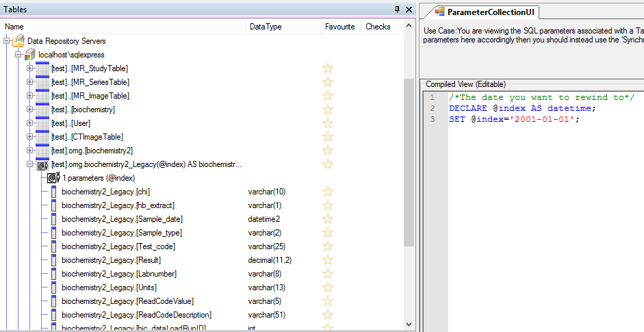
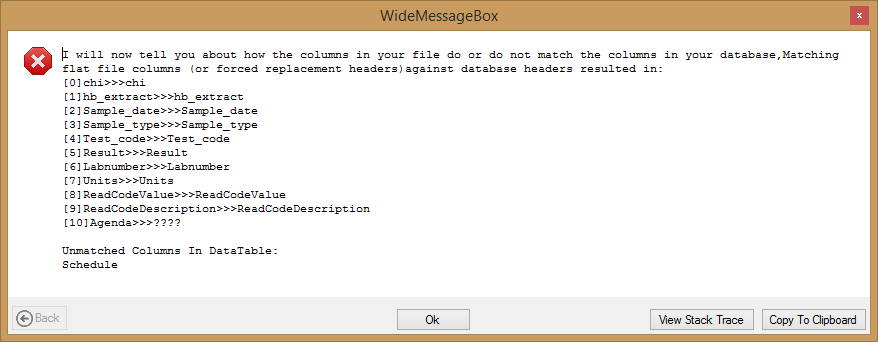
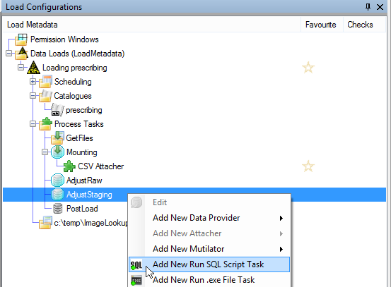
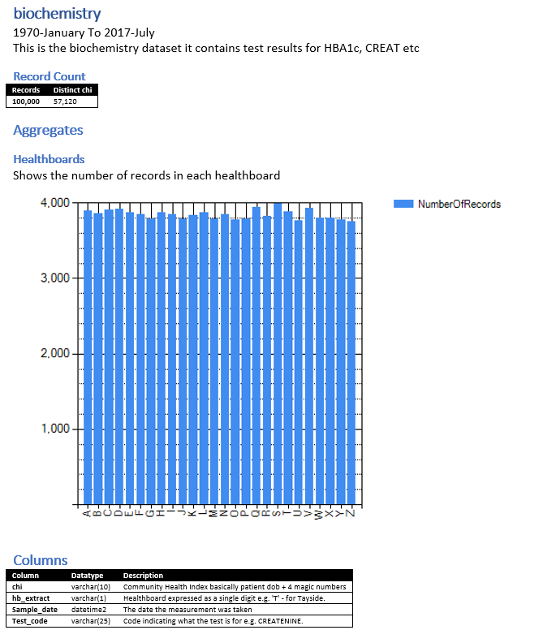
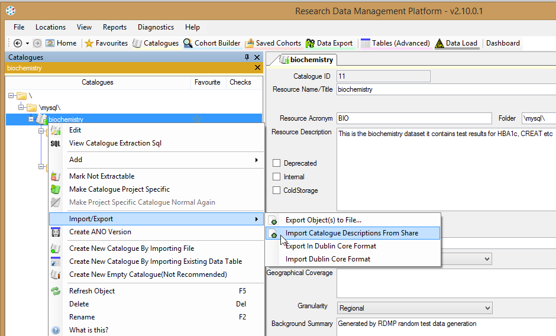

# Frequently Asked Questions
## Table of contents
1. Compatibility
   1. [Does RDMP have a Command Line Interface?](#cli)
   1. [Does RDMP have an API?](#api)
   1. [Does RDMP Support Plugins?](#plugins)
1. Database Compatibility
   1. [What databases does RDMP support?](#databases)
   1. [How do I set a custom port / SSL certificate / connection string option?](#connectionStringKeywords)
   1. [When I connect to MySql it says 'The host localhost does not support SSL connections'](#disableSSL)
   1. [Does RDMP Support Schemas?](#schemas)
   1. [Does RDMP Support Views?](#views)
   1. [Does RDMP Support Table Valued Functions?](#tvf)
1. Data Load Engine
   1. [How does RDMP differ from classic tools e.g. SSIS?](#vsssis)
   1. [Can RDMP Load UnTyped Data?](#untyped)
   1. [How does RDMP deal with Csv/text files?](#csv)
   1. [How does RDMP handle / translate untyped, C# and Database Types?](#typetranslation)
   1. [When loading data can I skip some columns?](#skipColumns)
   1. [Can I run SQL Scripts during a load?](#sqlScripts)
1. Curation
   1. [What is a Catalogue?](#whatisacatalogue)
   1. [Can I share/export/import my dataset metadata?](#sharing)
   1. [Is there a Data Quality Engine?](#dqe)
1. User Interface Programming
   1. [How do I stop some nodes being reordered in RDMPCollectionUIs?](#reorder)
   1. [How do I add new nodes to RDMPCollectionUIs?](#addNewNodes)
   1. [My metadata databases are being hammered by thousands of requests](#databaseDdos)
1. Other Programming
   1. [Are there Unit/Integration Tests?](#tests)

## Compatibility
   
<a name="cli"></a>
### Does RDMP have a Command Line Interface (CLI)
Yes, the [RDMPAutomationService](../../Tools/RDMPAutomationService/) program allows command line execution of all major engines in RDMP (Caching / Data Load / Cohort Creation / Extraction and Release).  To access the CLI command line help system run:

```
RDMPAutomationService.exe --help
```

For help on each engine (verb) on the command line enter the verb (listed by the main --help command) followed by --help e.g.:

```
RDMPAutomationService.exe dle --help
```

When performing an operation in the RDMP client application (e.g. releasing a dataset) you can instead select 'Copy Run Command To Clipboard'.  This will generate a CLI command that will perform the current action (e.g. extract Project X using Pipeline Y).  This can be helpful for scheduling long running tasks etc.


<a name="api"></a>
### Does RDMP have an API?
Yes, RDMP can be controlled programmatically through it's API which is available as 3 NuGet packages 
- [HIC.RDMP.Plugin](https://www.nuget.org/packages/HIC.RDMP.Plugin): All core objects, engines etc
- [HIC.RDMP.Plugin.UI](https://www.nuget.org/packages/HIC.RDMP.Plugin.UI): All definitions for writing user interface plugins that run in the main RDMP client application.
- [HIC.RDMP.Plugin.Test](https://www.nuget.org/packages/HIC.RDMP.Plugin.Test/): Classes to simplify writing Unit/Integration Tests for RDMP plugins

<a name="plugins"></a>
### Does RDMP Support Plugins?
Yes, RDMP supports both functional plugins (e.g. new anonymisation components, new load plugins etc) as well as UI plugins (e.g. new operations when you right click a `Catalogue`).

https://github.com/HicServices/RDMP/blob/develop/Documentation/CodeTutorials/PluginWriting.md

## Database Compatibility

<a name="databases"></a>
### What databases does RDMP support
RDMP uses [FAnsiSql](https://github.com/HicServices/FAnsiSql) to discover, query and connect to databases.  Currently this includes support for Sql Server, MySql and Oracle.

<a name="connectionStringKeywords"></a>
### How do I set a custom port / SSL certificate / connection string option?
RDMP manages connection strings internally.  If you want a keyword applied on your connection strings you can add it in the 'Connection String Keywords' node.  Each keyword is associated with a single database provider (MySql, Oracle etc).  In order for the changes to take effect you will need to restart RDMP.


<a name="disableSSL"></a>
### When I connect to MySql it says 'The host localhost does not support SSL connections'
If your MySql server does not support SSL connections then you can specify a [Connection String Keyword](#connectionStringKeywords) 'SSLMode' with the Value 'None' (Make sure you select DatabaseType:MySQLServer)

<a name="schemas"></a>
### Does RDMP Support Schemas?

Yes.  In Microsoft Sql Server, Schema is a scope between Database and Table.  By default all tables get created in the 'dbo' schema but it is possible to create tables in other schemas.  For example

```sql
--Table get's created in the default schema 'dbo'
create table test..MyTable1(MyCol int not null)

--Table get's created in the schema 'omg' within the database 'test'
create schema omg
create table test.omg.MyTable1(MyCol int not null)
```

When importing a table RDMP will record the schema it came from and fully qualify calls to the table.  When running the data load engine RAW and STAGING tables will always be created in dbo (to avoid issuing schema creation commands).

<a name="views"></a>
### Does RDMP Support Views?

Yes, when importing a table from a database to create a `Catalogue` any views in the database will also be shown.  These are interacted with in exactly the same manner as regular tables.

You cannot load a view with data using the Data Load Engine.

<a name="tvf"></a>
### Does RDMP Support Table Valued Functions?

When importing a table from a Microsoft Sql Server database to create a `Catalogue` any table valued functions in the database will also be shown.  When you import these you will get a `TableInfo` which contains default values to supply to the function when querying it.  You can override these parameters e.g. for a project extraction, cohort identification configuration etc.



## Data Load Engine

<a name="vsssis"></a>

### How does RDMP differ from classic tools e.g. SSIS?

RDMP is primarily a data management tool and does not seek to replace existing ETL tools (e.g. SSIS) that you might use for complex data transforms / data migrations etc.  That said, routine loading of clinical/research datasets differ from these traditional ETL jobs in key ways which make a bespoke tool (RDMP) useful:

- Data sources are error prone 
  - Duplication
  - Badly formatted files (e.g. unescaped CSV)
  - Schema changes (e.g. columns changing periodically)
- Scale in dimensions other than row count
  - By number of dataset
  - By number of columns (e.g. researcher adds some new columns to his dataset)
- Require specific narrow set of transformations (e.g. anonymisation)
- Benefits from traceability
  - When each row appeared
  - When row values change (when and what old values were)
  - Which job/batch loaded a given row (allows tracing rows back to original source files)
 
The Data Load Engine is designed to rapidly build simple data loads with a robust framework for error detection, traceability and duplication avoidance.  Core to the data load process implemented in RMDP is the automatic migration of the data you are trying to load through increasingly structured states (RAW=>STAGING=>LIVE).  This allows for rapid error detection and ensures that bad data remains in an isolated area for inspection by data analysts.
  


A full description of the mechanics and design of the DLE can be found in the [UserManual](../UserManual.docx)

<a name="untyped"></a>
### Can RDMP Load UnTyped Data?
Yes, [determining database types from untyped data (e.g. CSV)](./DataTableUpload.md) is a core feature.

<a name="csv"></a>
### How does RDMP deal with Csv/text files?
RDMP supports files delimited by any character (tab separated, pipe separated, comma separated etc).  Since [invalid formatting is a common problem with ETL of CSV files RDMP has several fault tolerance features](./CSVHandling.md).

<a name="typetranslation"></a>
### How does RDMP handle / translate untyped, C# and Database Types?
[TypeTranslation is handled by FAnsiSql](https://github.com/HicServices/FAnsiSql/blob/master/Documentation/TypeTranslation.md).

<a name="skipColumns"></a>
### When loading data can I skip some columns?
The data load engine first loads all data to the [temporary unconstrained RAW database](#data-load-engine) then migrates it to STAGING and finally merges it with LIVE (See [UserManual.docx](../UserManual.docx) for more info).  It is designed to make it easy to identify common issues such as data providers renaming columns, adding new columns etc.



The above message shows the case where there is a new column appearing for the first time in input files for the data load (Agenda) and an unmatched column in your RAW database (Schedule).  This could be a renamed column or it could be a new column with a new meaning.  Once you have identified the nature of the new column (new or renamed) then there are many ways to respond.  You could handle the name change in the DLE (e.g. using ForceHeaders or a Find and Replace script).  Or you could send an email to data provider rejecting the input file.

In order for this to work the DLE RAW Attachers enforce the following rules:

1. Unmatched columns in RAW are ALLOWED.  For example you could have a column 'IsSensitiveRecord' which is in your live table but doesn't appear in input files.
2. Unmatched columns in files are NOT ALLOWED.  If a flat file has a column 'Dangerous' you must have a corresponding column in your dataset

If you have columns in your file that you straight up don't want to load (see 2 above) then you can list them explicitly using the IgnoreColumns setting of your Attacher.


If you need to process data in the columns but don't want them in your final LIVE database table (e.g. to merge two fields or populate an aggregate column) then you can create a virtual RAW only column (called a PreLoadDiscardedColumn).  PreLoadDiscardedColumns are columns which are supplied by data providers but which you do not want in your LIVE database.  Each PreLoadDiscardedColumn can either:

1. Be created in RAW and then thrown away (`Oblivion`).  This is useful if there are columns you don't care about or combo columns you want to use only to populate other columns (e.g. FullPatientName=> Forename + Surname) 
2. Be dumped into an identifier dump (`StoreInIdentifiersDump`).  This is useful if you are supplied with lots of identifiable columns that you want to keep track of but separated from the rest of the data
3. Be promoted to LIVE in a diluted form (`Dilute`).  For example you might want to promote PatientName as a 1 or a 0 indicating whether or not it was provided and store the full name in the identifier dump as above.

Creating a `PreLoadDiscardedColumn` can be done by right clicking the `TableInfo`	.  You will need to specify both the name of the virtual column and the datatype as it should be created in RAW (it won't appear in your LIVE table).


If you want to dump / dilute the column you must configure a dump server.  And in the case of dilution, you will also have to add a `Dilution` mutilator to `AdjustStaging` and a column to your live schema for storing the diluted value.


This approach gives a single workflow for acknowledging new columns and making conscious decisions about how to treat that data.  And since it is ALLOWED for columns in the database to appear that are not in input files you can still run the new load configuration on old files without it breaking.

<a name="sqlScripts"></a>
### Can I run SQL Scripts during a load?
Yes once you have a load set up you can add SQL scripts to adjust the data in RAW / STAGING during the load.  You can also run scripts in PostLoad (which happens after data is migrated into the LIVE tables) but this is not recommended since it breaks the paradigm load isolation.




The Load Diagram shows the tables that will exist in RAW/STAGING.  Notice that the names for the tables/databases change depending on the stage.  This is handled by autocomplete when writing scripts (see below).


If you want to make a script agnostic of the LoadStage or if you are writing your own `INameDatabasesAndTablesDuringLoads` then you can reference columns/tables by ID using the following Syntax

```
{T:100}
```

Where T is for `TableInfo` and 100 is the `ID` of the `TableInfo` you want the name of.  You can find the ID by viewing the ID column of the Tables collection:


If you want to share one script between lots of different loads you can drag the .sql file from Windows Explorer onto the bubble node (e.g. AdjustStaging)


In order to allow other people to run the data load it is advised to store all SQL Script files on a shared network drive.

## Curation

<a name="whatisacatalogue"></a>
### What is a Catalogue?
A Catalogue is RDMP's representation of one of your datasets e.g. 'Hospital Admissions'.  A Catalogue consists of:

* Human readable names/descriptions of what is in the dataset it is
* A collection of items mapped to underlying columns in your database.  Each of these:
	* Can be extractable or not, or extractable only with SpecialApproval
	* Can involve a transform on the underlying column (E.g. hash on extraction, UPPER etc)
	* Have a human readable name/description of the column/transform
	* Can have curated WHERE filters defined on them which can be reused for project extraction/cohort generation etc
* Validation rules for each of the extractable items in the dataset
* Graph definitions for viewing the contents of the dataset (and testing filters / cohorts built)
* Attachments which help understand the dataset (e.g. a pdf file)


A Catalogue can be a part of project extraction configurations, used in cohort identification configurations.  They can be marked as Deprecated, Internal etc.

The separation of dataset and underlying table allows you to have multiple datasets both of which draw data from the same table.  It also makes it easier to handle moving a table/database (e.g. to a new server or database) / renaming etc.

Internally Catalogues are stored in the Catalogue table of the RDMP platform database (e.g. RDMP_Catalogue).  The ID field of this table is used by other objects to reference it (e.g. CatalogueItem.Catalogue_ID).  

<a name="sharing"></a>
### Can I share/export/import my dataset metadata?

There are 4 ways to export/import dataset descriptions from RDMP

* [Metadata Report](#metadata-report)
* [Share Definition](#share-definition)
* [Dublin Core](#dublin-core)
* [DITA](#dita)

#### Metadata Report

This report is accessed through the 'Reports' menu.  It uses [DocX](https://github.com/xceedsoftware/DocX) to write a Microsoft Word file containing the dataset description, row count, unique patient count as well as any graphs that are marked extractable.

This report can be generated for a specific dataset only or all datasets.  A variant of this report is produced when performing a project extraction which shows only the subset of data extracted for the given project/cohort.

#### Example Metadata Report



#### Share Definition

If you want to share dataset description, column descriptions etc with another RDMP user (in another organisation) you can export your Catalogue as a .sd file.  This contains JSON definitions for the `Catalogue` and all `CatalogueItem` objects.  This includes Validation XML and all the additional fields e.g. Granularity Coverage, Background Summary etc.  The share does not include the mapping between descriptions and underlying columns or the extraction SQL since this is likely to vary by site.

You can import a Share Definition (.sd) file previously generated by yourself or another RMDP user to load the stored descriptions.  This is useful if two or more organisations have semantically similar copies of the same dataset (e.g. SMR01).  When importing a Share Definition file you will import all column descriptions (`CatalogueItem`) even if you do not have them in your database (they simply won't be mapped to an underlying database column).

Share Definition files include JSON serialization of values and are not designed to be human readable.



#### Dublin Core

`Catalogue` descriptive metadata can be serialized into an xml file which follows the [Dublin Core guidelines]( http://dublincore.org/documents/dc-xml-guidelines/).  RDMP can load dataset descriptions from `<metadata>` `XElements` which follow this xmlns.

An example can be seen below:

```xml
<metadata xmlns:xsi="http://www.w3.org/2001/XMLSchema-instance" xmlns:dc="http://purl.org/dc/elements/1.1/" xmlns:dcterms="http://purl.org/dc/terms/">
  <dc:title>biochemistry</dc:title>
  <dcterms:alternative>BIO</dcterms:alternative>
  <dc:subject>biochemistry, blood, urine, Tayside</dc:subject>
  <dc:description>This is the biochemistry dataset it contains test results for HBA1c, CREAT etc</dc:description>
  <dc:publisher />
  <dcterms:isPartOf xsi:type="dcterms:URI" />
  <dcterms:identifier xsi:type="dcterms:URI" />
  <dc:format xsi:type="dcterms:IMT" />
</metadata>
```

#### DITA

You can export all dataset descriptions as [.dita files](http://ditaspec.suite-sol.com/Home_ditaspec.html) and a single .ditamap using the Reports menu.

An example .dita file is shown below:

```xml
<?xml version="1.0" encoding="UTF-8"?>
<!DOCTYPE concept PUBLIC "-//OASIS//DTD DITA Concept//EN"
"concept.dtd"><concept id="bio">
<title>biochemistry</title>
<conbody>
<simpletable keycol="1">
<strow>
<stentry>Acronym</stentry>
<stentry>BIO</stentry>
</strow>
<strow>
<stentry>Name</stentry>
<stentry>biochemistry</stentry>
</strow>
<strow>
<stentry>Description</stentry>
<stentry>This is the biochemistry dataset it contains test results for HBA1c, CREAT etc</stentry>
</strow>
<strow>
<stentry>Type</stentry>
<stentry>EHRExtract</stentry>
</strow>
<strow>
<stentry>Periodicity</stentry>
<stentry>Daily</stentry>
</strow>
...
```

<a name="dqe"></a>
### Is there a Data Quality Engine?
Yes.  You can read more about the DQE in the [technical implementation](./Validation.md) or (from a user perspective) in the [User Manual](../UserManual.docx).

## User Interface Programming

<a name="reorder"></a>
### How do I stop some nodes being reordered in RDMPCollectionUIs?
Sometimes you want to limit which nodes in an `RDMPCollectionUI` are reordered when the user clicks on the column header.  In the below picture we want to allow the user to sort data loads by name but we don't want to reorder the ProcessTask nodes or the steps in them since that would confuse the user as to the execution order.

 

You can prevent all nodes of a given Type from being reordered (relative to their branch siblings) by inheriting `IOrderable` and returning an appropriate value:

```csharp
public class ExampleNode : IOrderable
{
	public int Order { get { return 2; } set {} }
}
```

If you are unsure what Type a given node is you can right click it and select 'What Is This?'.

<a name="addNewNodes"></a>
### How do I add new nodes to RDMPCollectionUIs?
This requires a tutorial all of it's own 

https://github.com/HicServices/RDMP/blob/develop/Documentation/CodeTutorials/CreatingANewCollectionTreeNode.md


<a name="databaseDdos"></a>
### My metadata databases are being hammered by thousands of requests?
The entire RDMP meta data model is stored in platform databases (Catalogue / Data Export etc).  Classes e.g. `Catalogue` are fetched either all at once or by `ID`.  The class Properties can be used to fetch other related objects e.g. `Catalogue.CatalogueItems`.  This usually does not result in a bottleneck but under some conditions deeply nested use of these properties can result in your platform database being hammered with requests.  You can determine whether this is the case by using the PerformanceCounter.  This tool will show every database request issued while it is running including the number of distinct Stack Frames responsible for the query being issued.  Hundreds or even thousands of requests isn't a problem but if you start getting into the tens of thousands for trivial operations you might want to refactor your code.

 

Typically you can solve these problems by fetching all the required objects up front e.g.

```csharp
var catalogues = repository.GetAllObjects<Catalogue>();
var catalogueItems = repository.GetAllObjects<CatalogueItem>();
```

If you think the problem is more widespread then you can also use the `IInjectKnown<T>` system to perform `Lazy` loads which prevents repeated calls to the same property going back to the database every time.

https://github.com/HicServices/RDMP/blob/develop/Reusable/MapsDirectlyToDatabaseTable/Injection/README.md

## Other Programming

<a name="tests"></a>
### Are there Unit/Integration Tests?
Yes there are over 1,000 unit and integration tests, this is covered in [Tests](Tests.md)


