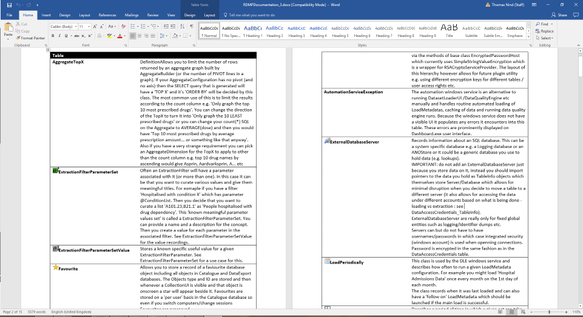
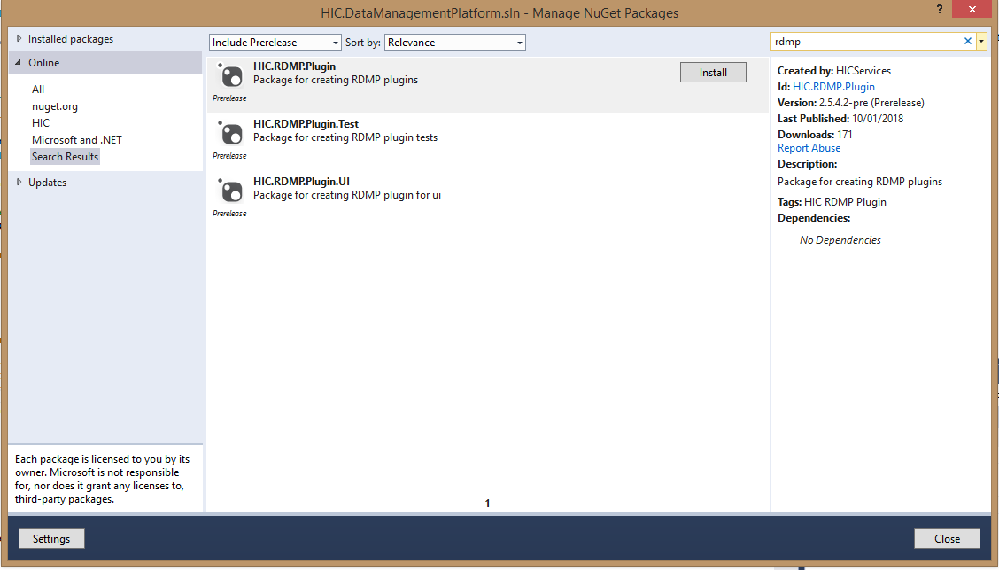
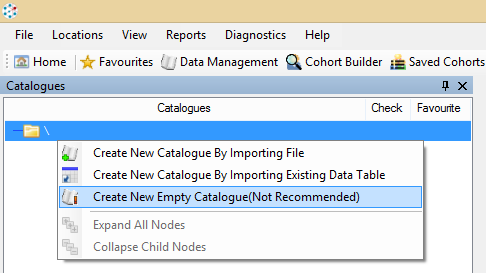
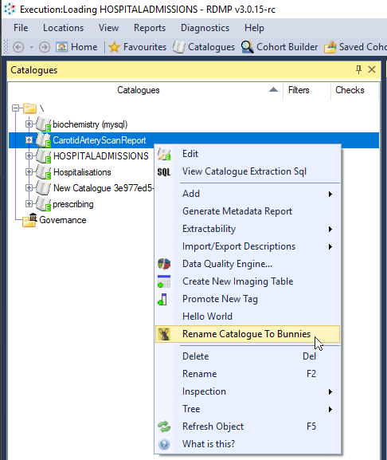
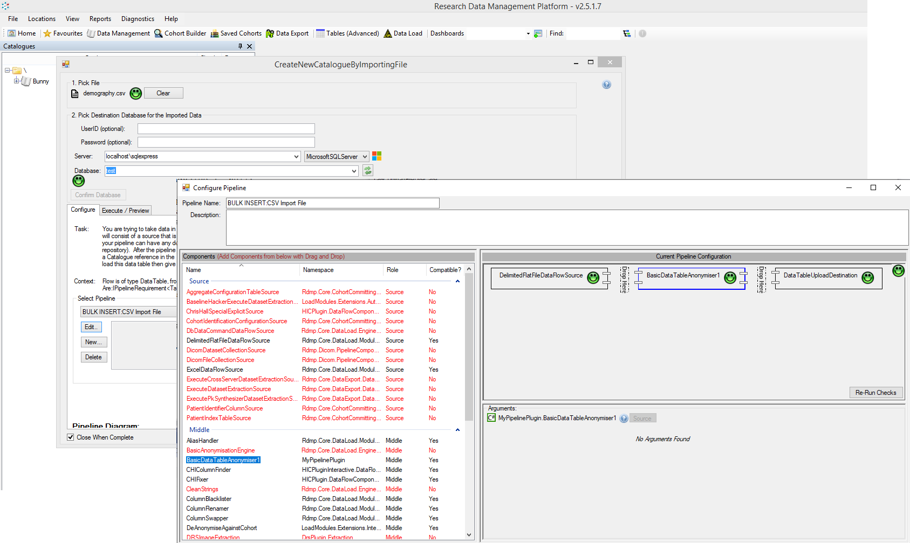
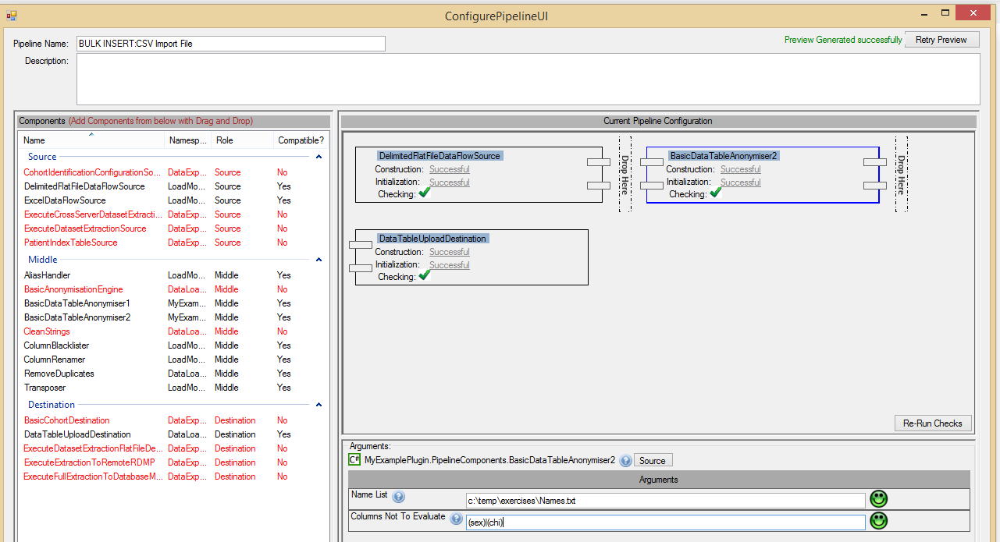
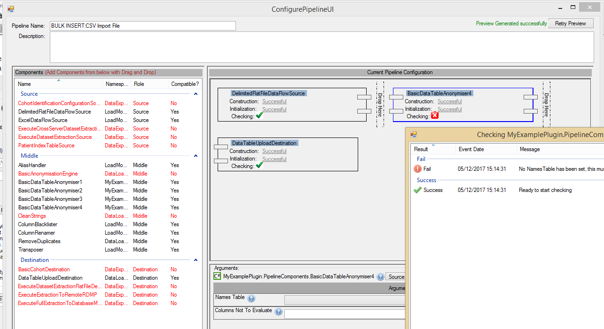

# Table of contents
1. [RDMP Binary and Documentation](#binary)
1. [Hello World Plugin](#helloWorldPlugin)
2. [Attaching the Debugger](#debugging)
3. [Streamlining Build](#betterBuilding)
4. [Hello World UI Command Execution](#commandExecution)
5. [A basic anonymisation plugin](#basicAnoPlugin)
  * [Version 1](#anoPluginVersion1)
  * [Version 2](#anoPluginVersion2)
  * [Version 3](#anoPluginVersion3)
6. [Tests](#tests)
  * [Unit Tests](#unitTests)
  * [Setting up Database Tests](#databaseTestsSetup)
  * [Writting a Database Test](#databaseTestsWritting)
7. [Checks](#checks)
  * [Version 4](#anoPluginVersion4)
7. [Progress Logging](#progress)
  * [Version 5](#anoPluginVersion5)
  * [What is wrong with NLog etc?](#NLog)
  * [What other funky things can I do with IDataLoadEventListener?](#funkyIDataLoadEventListener)

<a name="binary"></a>
# RDMP Binary and Documentation
The Research Data Management Platform Binaries are available via Click Once installer at https://hic.dundee.ac.uk/Installers/RDMP/ .  In order to use RDMP you will also need access to a Microsoft Sql Server (Sql Express is fine for testing/development).  After completing the setup process the main UI will launch.

From here you can access several resources that help understand RDMP classes / patterns etc.  


Firstly there is the 'Help=>Show User Manual' (also available at https://github.com/HicServices/RDMP/blob/master/Documentation/UserManual.docx).

Secondly there is the 'Help=>Generate Class/Table Summary' which describes the DatabaseEntity objects that appear in RDMPCollectionUIs and are core concepts for RDMP.



Thirdly 'Help=>Show Help' will show a dialog telling you what User Interface control you are in (class name) and any comments the class has (works for content tabs only - not collection trees).

Fourthly there is the Tutorial system 'Help=>Tutorials' which cover the basics for setting up RDMP test data, importing files etc.

Finally for the ambitious the 'Help=>Generate User Interface Documentation' will screencap and summarise all user interfaces in RDMP (takes a while).


 <a name="helloWorldPlugin"></a>
 # Hello World Plugin
 Create a new Visual Studio Class Library Project targetting .Net Framework 4.5

 Add a reference to the nuget packages `HIC.RDMP.Plugin` and `HIC.RDMP.Plugin.UI`.  For the purposes of this demo we are adding all classes to the same csproj but it is good practice to separate UI from engine code (i.e. An Engine Project containing implementation logic and A UI Project containing user interfaces).
 
 
  Make sure that the major and minor version number (first two numbers) of the Nuget Package match your installed version of RDMP (Visible in the task bar of the main RDMP application)

 

 Add a class called `MyPluginUserInterface` and inherit from `CatalogueManager.PluginChildProvision.PluginUserInterface` (Make sure you inherit from the abstract base and not the interface) override `GetAdditionalRightClickMenuItems`

```csharp
 public override ToolStripMenuItem[] GetAdditionalRightClickMenuItems(object o)
        {
            if (o is Catalogue)
                return new[] { new ToolStripMenuItem("Hello World", null, (s, e) => MessageBox.Show("Hello World")) };

            return null;
        }
```

 Launch Research Data Management Platform main application either by building it from source or installing via ClickOnce (https://hic.dundee.ac.uk/Installers/RDMP/Stable/).
Then launch Manage Plugins from the Home screen (under Advanced).  Select Add Plugin...

  

 Next add a new empty Catalogue

 

 Now right click it.  You should see your message appearing.

 

 <a name="debugging"></a>
 # Attaching the Debugger
 Sometimes you want to debug your plugin as it is running hosted by RDMP.  To do this simply launch `ResearchDataManagementPlatform.exe` manually (if you need to see where the exe is you can select Diagnostics=>Open exe directory at any time).  Next go into visual studio and select Debug=>Attach to Process

 <a name="betterBuilding"></a>
 # Streamlining Build
 There are a couple of things you can do to streamline your plugin development process (avoid having to manually commit the plugin every time).  Firstly You can remove the requirement to launch 'Manage Plugins' by setting up a post build step which runs PluginPackager.exe.  This will commit the plugin into the RMDP database.  Secondly you can add the ResearchDataManagementPlatform.exe as a startup project in your plugin solution.

## Adding a post build script to commit the plugin 

 (See https://docs.microsoft.com/en-gb/visualstudio/ide/how-to-specify-build-events-csharp)

 The executable responsible for commiting plugins is PluginPackager.exe, it should appear in your bin directory when you build your plugin.  

 Right click your Project and select Properties

 Enter a Post-build script to run PluginPackager.exe.  Make sure that you substitute your test server / database below: e.g.

```
$(TargetDir)PluginPackager.exe $(SolutionPath) $(SolutionName).zip -s localhost\sqlexpress -d RDMP_Catalogue

```

Now when you build your project (you may need to Clean and Rebuild) you should see the following:
```
  MyExamplePlugin -> E:\RDMP\Documentation\CodeTutorials\CodeExamples\MyExamplePlugin\bin\Debug\MyExamplePlugin.dll
  Found .csproj file reference at path: MyExamplePlugin\MyExamplePlugin.csproj
  SUCCESS: Found it at:E:\RDMP\Documentation\CodeTutorials\CodeExamples\MyExamplePlugin
  Your plugin targets CatalogueLibrary version 2.5.1.6
  Could not find dependent dll System.Drawing.dll
  Could not find dependent dll System.Windows.Forms.dll
  File MyExamplePlugin.dll uploaded as a new LoadModuleAssembly under plugin CodeExamples.zip
  File src.zip uploaded as a new LoadModuleAssembly under plugin CodeExamples.zip
```

(Do not worry about dependent dll messages)

## Adding a debug target
Right click your Solution and select 'Add Existing Project...' and navigate to the ResearchDataManagementPlatform.exe file.

This should add a new root level item in your Solution called 'ResearchDataManagementPlatform'

Right click it and set it as the startup project

Now when you start your plugin project the RDMP application will launch with the debugger attached.

<a name="commandExecution"></a>
# Hello World UI Command Execution
Rather than throwing around `ToolStripMenuItem` you can make use of the `ReusableLibraryCode.CommandExecution.ICommandExecution` system.

Create a new class `ExecuteCommandRenameCatalogueToBunnies` inherit from base class `CatalogueManager.CommandExecution.AtomicCommands.BasicUICommandExecution` and implement `ReusableUIComponents.CommandExecution.AtomicCommands.IAtomicCommand`.

```csharp
   public class ExecuteCommandRenameCatalogueToBunnies:BasicUICommandExecution, IAtomicCommand
    {
        private readonly Catalogue _catalogue;

        public ExecuteCommandRenameCatalogueToBunnies(IActivateItems activator,Catalogue catalogue) : base(activator)
        {
            _catalogue = catalogue;

			if(catalogue.Name == "Bunny")
                SetImpossible("Catalogue is already called Bunny");
        }

        public Image GetImage(IIconProvider iconProvider)
        {
			//icon to use for the right click menu (return null if you don't want one)
            return Resources.Bunny;
        }

        public override void Execute()
        {
            base.Execute();

			//change the name
            _catalogue.Name = "Bunny";
			
			//save the change
            _catalogue.SaveToDatabase();

			//Lets the rest of the application know that a change has happened
            Publish(_catalogue);
        }
```

Adjust the plugin user interface class to return an instance of this new command:

```csharp
public class MyPluginUserInterface:PluginUserInterface
    {
        public MyPluginUserInterface(IActivateItems itemActivator) : base(itemActivator)
        {
        }
        
        public override ToolStripMenuItem[] GetAdditionalRightClickMenuItems(object o)
        {
            if (o is Catalogue)
                return new[]
                {
                    new ToolStripMenuItem("Hello World", null, (s, e) => MessageBox.Show("Hello World")),

                    GetMenuItem(new ExecuteCommandRenameCatalogueToBunnies(ItemActivator,(Catalogue)o))
                };

            return null;
        }

    }
```

Now when you right click a Catalogue you should see your command offered to the user:



<a name="basicAnoPlugin"></a>
# A (very) basic Anonymisation Plugin

<a name="anoPluginVersion1"></a>
## Version 1
Most of the processes in RDMP use the `CatalogueLibrary.Data.Pipelines.Pipeline` system.  This involves a series of components performing operations on a flow of objects of type T (often a `System.Data.DataTable`).  The pipeline is setup/tailored by RDMP users and then reused every time the task needs to be executed.  For example importing a csv file into the database and generating a Catalogue from the resulting table (the first thing you do when playing with the RDMP test data) happens through a pipeline called 'BULK INSERT:CSV Import File'.


In this tutorial we will write a reusable component which lets the user identify problem strings (names) in data they are importing.

Declare a new class `BasicDataTableAnonymiser1` and implement IPluginDataFlowComponent<DataTable>


```csharp
public class BasicDataTableAnonymiser1: IPluginDataFlowComponent<DataTable>
{
	private static readonly string[] CommonNames = { "Thomas", "Wallace", "Young" };

	public DataTable ProcessPipelineData(DataTable toProcess, IDataLoadEventListener listener,GracefulCancellationToken cancellationToken)
	{
		//Go through each row in the table
		foreach (DataRow row in toProcess.Rows)
		{
			//for each cell in current row
			for (int i = 0; i < row.ItemArray.Length; i++)
			{
				//if it is a string
				var stringValue = row[i] as string;

				if(stringValue != null)
				{
					//replace any common names with REDACTED
					foreach (var name in CommonNames)
						stringValue =  Regex.Replace(stringValue, name, "REDACTED",RegexOptions.IgnoreCase);

					row[i] = stringValue;
				}
			}
		}

		return toProcess;
	}

	public void Dispose(IDataLoadEventListener listener, Exception pipelineFailureExceptionIfAny)
	{
		
	}

	public void Abort(IDataLoadEventListener listener)
	{
		
	}

	public void Check(ICheckNotifier notifier)
	{
		
	}
}
```

Select 'demography.csv' for import (See UserManual.docx for generating test data - Help=>Show User Manual).  Choose a database as the destination and select 'Advanced'.  Select the `BULK INSERT:CSV Import File` pipeline and click Edit.

Drag and drop BasicDataTableAnonymiser1 into the middle of the pipeline.



Execute the import and do a select out of the final table to confirm that it has worked:

```sql
select * from test..demography where forename like '%REDACTED%'
```

<a name="anoPluginVersion2"></a>
## Version 2 - Adding arguments
You can add user configured properties by declaring public auto properties decorated with `[DemandsInitialization]` (`CatalogueLibrary.Data.DemandsInitializationAttribute`).  This attribute is supported on a wide range of common Types (see `CatalogueLibrary.Data.DataLoad.Argument`.`PermissableTypes` for a complete list) and some RDMP object Types (e.g. `CatalogueLibrary.Data.Catalogue`).  Let's add a file list of common names and a regular expression that lets you skip columns you know won't have any names in.

Add a new component BasicDataTableAnonymiser2 (or adjust your previous component).  Add two public properties as shown below.

```csharp
public class BasicDataTableAnonymiser2: IPluginDataFlowComponent<DataTable>
    {
        [DemandsInitialization("List of names to redact from columns", mandatory:true)]
        public FileInfo NameList { get; set; }

        [DemandsInitialization("Columns matching this regex pattern will be skipped")]
        public Regex ColumnsNotToEvaluate { get; set; }

        private string[] _commonNames;
        
        public DataTable ProcessPipelineData(DataTable toProcess, IDataLoadEventListener listener,GracefulCancellationToken cancellationToken)
        {
            if (_commonNames == null)
                _commonNames = File.ReadAllLines(NameList.FullName);

            //Go through each row in the table
            foreach (DataRow row in toProcess.Rows)
            {
                //for each cell in current row
                foreach (DataColumn col in toProcess.Columns)
                {
                    //if it's not a column we are skipping
                    if(ColumnsNotToEvaluate != null && ColumnsNotToEvaluate.IsMatch(col.ColumnName))
                        continue;
                    
                    //if it is a string
                    var stringValue = row[col] as string;

                    if(stringValue != null)
                    {
                        //replace any common names with REDACTED
                        foreach (var name in _commonNames)
                            stringValue =  Regex.Replace(stringValue, name, "REDACTED",RegexOptions.IgnoreCase);

                        row[col] = stringValue;
                    }
                }
            }

            return toProcess;
        }

        public void Dispose(IDataLoadEventListener listener, Exception pipelineFailureExceptionIfAny)
        {
            
        }

        public void Abort(IDataLoadEventListener listener)
        {
            
        }

        public void Check(ICheckNotifier notifier)
        {
            
        }
	}
```

Drop the demography table from your database (and delete any associated Catalogues / TableInfos in RDMP).  Import demography.csv again but edit the pipeline to include the new component BasicDataTableAnonymiser2.  Now when you select it you should be able to type in some values.



<a name="anoPluginVersion3"></a>
## Version 3 - Referencing a database table
Having a text file isn't that great, it would be much better to power it with a database table.  

Create a new plugin component BasicDataTableAnonymiser3 (or modify your existing one).  Get rid of the property NameList and add a TableInfo one instead:

```csharp
 public class BasicDataTableAnonymiser3: IPluginDataFlowComponent<DataTable>
    {
        [DemandsInitialization("Table containing a single column which must have a list of names to redact from columns", mandatory:true)]
        public TableInfo NamesTable { get; set; }

        [DemandsInitialization("Columns matching this regex pattern will be skipped")]
        public Regex ColumnsNotToEvaluate { get; set; }

        private string[] _commonNames;
        
        public DataTable ProcessPipelineData(DataTable toProcess, IDataLoadEventListener listener,GracefulCancellationToken cancellationToken)
        {
            if (_commonNames == null)
            {
                //get access to the database under DataLoad context
                var databaseDiscovered = DataAccessPortal.GetInstance().ExpectDatabase(NamesTable, DataAccessContext.DataLoad);

                //expect a table matching the TableInfo
                var tableDiscovered = databaseDiscovered.ExpectTable(NamesTable.GetRuntimeName());

                //make sure it exists
                if(!tableDiscovered.Exists())
                    throw new NotSupportedException("TableInfo '" + tableDiscovered + "' does not exist!");
                
                //Download all the data
                var dataTable = tableDiscovered.GetDataTable();

                //Make sure it has the correct expected schema (i.e. 1 column)
                if(dataTable.Columns.Count != 1)
                    throw new NotSupportedException("Expected a single column in DataTable '" + tableDiscovered +"'");

                //turn it into an array
                _commonNames = dataTable.AsEnumerable().Select(r => r.Field<string>(0)).ToArray();
            }

            //Go through each row in the table
            foreach (DataRow row in toProcess.Rows)
            {
                //for each cell in current row
                foreach (DataColumn col in toProcess.Columns)
                {
                    //if it's not a column we are skipping
                    if(ColumnsNotToEvaluate != null && ColumnsNotToEvaluate.IsMatch(col.ColumnName))
                        continue;
                    
                    //if it is a string
                    var stringValue = row[col] as string;

                    if(stringValue != null)
                    {
                        //replace any common names with REDACTED
                        foreach (var name in _commonNames)
                            stringValue =  Regex.Replace(stringValue, name, "REDACTED",RegexOptions.IgnoreCase);

                        row[col] = stringValue;
                    }
                }
            }

            return toProcess;
        }

        public void Dispose(IDataLoadEventListener listener, Exception pipelineFailureExceptionIfAny)
        {
            
        }

        public void Abort(IDataLoadEventListener listener)
        {
            
        }

        public void Check(ICheckNotifier notifier)
        {
            
        }
    }
```

You will need to create the names table:

```sql

use test

create table NamesListTable 
(
Name varchar(500) primary key,
)
go

insert into NamesListTable values ('Thomas')
insert into NamesListTable values ('Mitchell')
insert into NamesListTable values ('Davis')
insert into NamesListTable values ('Walker')
insert into NamesListTable values ('Saunders')

```

And import it into RDMP as a TableInfo (you don't need to create a Catalogue if you don't want to, just the TableInfo part)


Test the plugin by importing demography.csv again through the pipeline with the new component implmentation

<a name="tests"></a>
# Tests

<a name="unitTests"></a>
## Unit Tests 
We definetly want to write some unit/integration tests for this component.  Create a new project called MyExamplePluginTests.  Add a reference to the NuGet package NUnit and a reference to `HIC.RDMP.Plugin.Test`.

Add the following test:

```csharp
public class TestAnonymisationPlugins
    {
        [Test]
        public void TestBasicDataTableAnonymiser1()
        {
            var dt = new DataTable();
            dt.Columns.Add("Story");
            dt.Rows.Add(new[] {"Thomas went to school regularly"});
            dt.Rows.Add(new[] {"It seems like Wallace went less regularly"});
            dt.Rows.Add(new[] {"Mr Smitty was the teacher"});

            var a = new BasicDataTableAnonymiser1();
            var resultTable = a.ProcessPipelineData(dt,new ThrowImmediatelyDataLoadEventListener(),new GracefulCancellationToken());

            Assert.AreEqual(resultTable.Rows.Count,3);
            Assert.AreEqual("REDACTED went to school regularly",resultTable.Rows[0][0]);
            Assert.AreEqual("It seems like REDACTED went less regularly",resultTable.Rows[1][0]);
            Assert.AreEqual("Mr Smitty was the teacher",resultTable.Rows[2][0]);
        }
    }
```

This is a very basic test.  We create a data table that would be flowing through our pipeline (e.g. as it was read from a csv file) and look for the REDACTED names appearing.  The only new bits we need to worry about are `ThrowImmediatelyDataLoadEventListener` and `GracefulCancellationToken`.  

`CatalogueLibrary.DataFlowPipeline.GracefulCancellationToken` is a wrapper for two `System.Threading.CancellationToken` (Abort and Cancel).  Since our component doesn't support aborting/cancelling anyway we don't need to worry about it.

`ReusableLibraryCode.Progress.IDataLoadEventListener` is the interface that handles messages generated by data flow components, this includes progress messages (done 1000 of x records) and notifications (Information, Warning, Error).  There are many implementations of `IDataLoadEventListener` including user interface components (e.g. `ReusableUIComponents.Progress.ProgressUI`) but we will use `ReusableLibraryCode.Progress.ThrowImmediatelyDataLoadEventListener` this is a data class that treats Error messages as Exceptions (hence the throw) but otherwise writes progress messages to the Console.

<a name="databaseTestsSetup"></a>

## Setting up Database Tests

Lets look at testing `BasicDataTableAnonymiser3`, this is harder since it involves having a user specified TableInfo that references a table of names.  We can do this though.

Start by making TestAnonymisationPlugins inherit from `Tests.Common.DatabaseTests`

Run the unit test again.  It should fail at test fixture setup with something like

```
SetUp : System.Data.SqlClient.SqlException : Cannot open database "TEST_Catalogue" requested by the login. The login failed.
Login failed for user 'YOURDOMAIN\YourName'.
```

Open a command console in the bin directory of the plugin (e.g. `E:\RDMP\Documentation\CodeTutorials\CodeExamples\MyExamplePluginTests\bin\Debug`)

Run `DatabaseCreation.exe localhost\sqlexpress TEST_ -D` (make sure the servername is correct for your Sql Server)

This will create a suite of test databases all prefixed `TEST_` in your database.  

If you had to change the location of your server or specified a custom prefix (i.e. not `TEST_`) then you will need to change `TestDatabases.txt` (this file should be in the root of your Tests project).  Also ensure that `TestDatabases.txt` is marked `Copy always` under `Copy to Output Directory` in the file Properties (F4).

Clean and Rebuild your project and run the unit test again. It should pass this time (if it doesn't, check that the `TEST_` databases exist and then double check the `TestDatabases.txt` file is being correctly copied to the test bin directory.

<a name="databaseTestsWritting"></a>
## Writting a Database Test
Add a new test 

```csharp
[Test]
        public void TestBasicDataTableAnonymiser3()
        {
            //Create a names table that will go into the database
            var dt = new DataTable();
            dt.Columns.Add("Name");
            dt.Rows.Add(new[] {"Thomas"});
            dt.Rows.Add(new[] {"Wallace"});
            dt.Rows.Add(new[] {"Frank"});

            //upload the DataTable from memory into the database
            var discoveredTable = DiscoveredDatabaseICanCreateRandomTablesIn.CreateTable("ForbiddenNames", dt);

            //import the persistent TableInfo reference
            var importer = new TableInfoImporter(CatalogueRepository, discoveredTable);
            
            TableInfo tableInfo;
            ColumnInfo[] columnInfos;
            importer.DoImport(out tableInfo,out columnInfos);

            //Create the test dataset chunk that will be anonymised
            var dtStories = new DataTable();
            dtStories.Columns.Add("Story");
            dtStories.Rows.Add(new[] { "Thomas went to school regularly" });
            dtStories.Rows.Add(new[] { "It seems like Wallace went less regularly" });
            dtStories.Rows.Add(new[] { "Mr Smitty was the teacher" });

            //Create the anonymiser
            var a = new BasicDataTableAnonymiser3();

            //Tell it about the database table
            a.NamesTable = tableInfo;

            //run the anonymisation
            var resultTable = a.ProcessPipelineData(dtStories, new ThrowImmediatelyDataLoadEventListener(),new GracefulCancellationToken());

            //check the results
            Assert.AreEqual(resultTable.Rows.Count, 3);
            Assert.AreEqual("REDACTED went to school regularly", resultTable.Rows[0][0]);
            Assert.AreEqual("It seems like REDACTED went less regularly", resultTable.Rows[1][0]);
            Assert.AreEqual("Mr Smitty was the teacher", resultTable.Rows[2][0]);

            //finally drop the database table
            discoveredTable.Drop();
        }
```

This has a few intersting lines in it.  Firstly we create a DataTable containing a Names column with some values then we use the base class property `DiscoveredDatabaseICanCreateRandomTablesIn` this is a database for creating test tables in.  The database is nuked before each test set is run (but not between Tests).  `DiscoveredDatabase.CreateTable` will upload the `DataTable` to the destination and return a `ReusableLibraryCode.DatabaseHelpers.Discovery.DiscoveredTable`.

As you might have guessed `Discovered[...]` is how we reference Servers / Databases / Tables / Columns as we find them at runtime.  These classes exist to provide simplified access to common tasks in a cross platform way (See `ReusableCodeTests.CrossPlatformTests`).

Once we have a `DiscoveredTable` we can create a persistent reference to it in the TEST_Catalogue database (`CatalogueLibrary.Data.TableInfo`) via `TableInfoImporter`.  The `TableInfo` pointer is given to the `BasicDataTableAnonymiser3` and used to anonymise the 'pipeline chunk' `dtStories` (like in the first unit test).

<a name="checks"></a>
# Checks
This is getting complex and could do with having some events, and a way for the user to check that it is working before running it.  Fortunately RDMP supports this with the `ReusableLibraryCode.Checks.ICheckNotifier` system.

<a name="anoPluginVersion4"></a>
## Version 4
Create an exact copy of `BasicDataTableAnonymiser3` called `BasicDataTableAnonymiser4`.  Move the initialization code for `_commonNames` into a method GetCommonNamesTable.

Next go into the empty `Check` method in your class (`BasicDataTableAnonymiser4`) and call the new method `GetCommonNamesTable`

```csharp
 public class BasicDataTableAnonymiser4 : IPluginDataFlowComponent<DataTable>
    {
        [DemandsInitialization("Table containing a single column which must have a list of names to redact from columns", mandatory: true)]
        public TableInfo NamesTable { get; set; }

        [DemandsInitialization("Columns matching this regex pattern will be skipped")]
        public Regex ColumnsNotToEvaluate { get; set; }

        private string[] _commonNames;

        public DataTable ProcessPipelineData(DataTable toProcess, IDataLoadEventListener listener, GracefulCancellationToken cancellationToken)
        {
            GetCommonNamesTable();

            //Go through each row in the table
            foreach (DataRow row in toProcess.Rows)
            {
                //for each cell in current row
                foreach (DataColumn col in toProcess.Columns)
                {
                    //if it's not a column we are skipping
                    if (ColumnsNotToEvaluate != null && ColumnsNotToEvaluate.IsMatch(col.ColumnName))
                        continue;

                    //if it is a string
                    var stringValue = row[col] as string;

                    if (stringValue != null)
                    {
                        //replace any common names with REDACTED
                        foreach (var name in _commonNames)
                            stringValue = Regex.Replace(stringValue, name, "REDACTED", RegexOptions.IgnoreCase);

                        row[col] = stringValue;
                    }
                }
            }

            return toProcess;
        }

        private void GetCommonNamesTable()
        {
            if (_commonNames == null)
            {
                //get access to the database under DataLoad context
                var databaseDiscovered = DataAccessPortal.GetInstance().ExpectDatabase(NamesTable, DataAccessContext.DataLoad);

                //expect a table matching the TableInfo
                var tableDiscovered = databaseDiscovered.ExpectTable(NamesTable.GetRuntimeName());

                //make sure it exists
                if (!tableDiscovered.Exists())
                    throw new NotSupportedException("TableInfo '" + tableDiscovered + "' does not exist!");

                //Download all the data
                var dataTable = tableDiscovered.GetDataTable();

                //Make sure it has the correct expected schema (i.e. 1 column)
                if (dataTable.Columns.Count != 1)
                    throw new NotSupportedException("Expected a single column in DataTable '" + tableDiscovered + "'");

                //turn it into an array
                _commonNames = dataTable.AsEnumerable().Select(r => r.Field<string>(0)).ToArray();
            }
        }

        public void Dispose(IDataLoadEventListener listener, Exception pipelineFailureExceptionIfAny)
        {

        }

        public void Abort(IDataLoadEventListener listener)
        {

        }

        public void Check(ICheckNotifier notifier)
        {
            GetCommonNamesTable();
        }
    }
```

Go to your unit tests and write a test for it passing it a `ReusableLibraryCode.Checks.ThrowImmediatelyCheckNotifier` (this is just like `ThrowImmediatelyDataLoadEventListener` in that it will treat all Fail messages - and optionally Warnings too as Exceptions and throw them).

```csharp
[Test]
public void TestBasicDataTableAnonymiser4_FailConditions()
{
	var a = new BasicDataTableAnonymiser4();
	a.Check(new ThrowImmediatelyCheckNotifier());
}
```

Running this test should give an error like 

```
System.NullReferenceException : Object reference not set to an instance of an object.
```

This is not very helpful.  We can use the `ReusableLibraryCode.Checks.ICheckNotifier` argument of `Check` to record the checking process.  This will look something like:
```csharp
notifier.OnCheckPerformed(new CheckEventArgs("Ready to start checking", CheckResult.Success, null, null));
```

The two null arguments are for Exception (if any) and the 'proposed fix' which is a string that describes how you can immediately fix the problem in a way where you want to delegate the descision (i.e. you don't want to automatically always fix it').  The return value of OnCheckPerformed is `bool` this indicates whether the fix should be attempted.  Most `ICheckNotifier` implementations provide static answers to fixes e.g. `ReusableLibraryCode.Checks.AcceptAllCheckNotifier` will return true but throw an Exception any time there is a check that fails without a ProposedFix.  Some `ICheckNotifier` will consult the user about whether to apply a ProposedFix e.g. `ReusableUIComponents.ChecksUI.ChecksUI`
  
For now we can ignore ProposedFix because nothing that goes wrong with our component can be easily fixed.

Start by passing the `notifier` argument into `GetCommonNamesTable` and use it to document the setup process (and any failures): 

```csharp
private void GetCommonNamesTable(ICheckNotifier notifier)
        {
            if (_commonNames == null)
            {
                if (NamesTable == null)
                {
                    notifier.OnCheckPerformed(
                        new CheckEventArgs(
                            "No NamesTable has been set, this must be a Table containing a list of names to REDACT from the pipeline data being processed",
                            CheckResult.Fail));

                    return;
                }

                //get access to the database under DataLoad context
                var databaseDiscovered = DataAccessPortal.GetInstance().ExpectDatabase(NamesTable, DataAccessContext.DataLoad);


                
                //expect a table matching the TableInfo
                var tableDiscovered = databaseDiscovered.ExpectTable(NamesTable.GetRuntimeName());

                //make sure it exists
                if (!tableDiscovered.Exists())
                    throw new NotSupportedException("TableInfo '" + tableDiscovered + "' does not exist!");

                //Download all the data
                var dataTable = tableDiscovered.GetDataTable();

                //Make sure it has the correct expected schema (i.e. 1 column)
                if (dataTable.Columns.Count != 1)
                    throw new NotSupportedException("Expected a single column in DataTable '" + tableDiscovered + "'");

                //turn it into an array
                _commonNames = dataTable.AsEnumerable().Select(r => r.Field<string>(0)).ToArray();
            }
        }
```

In order to compile we will need to update the call to `GetCommonNamesTable` in `ProcessPipelineData` too.  Fortunately we can use a `ThrowImmediatelyCheckNotifier`.

Now we can run our test and see an error that makes sense

```
[Test]
public void TestBasicDataTableAnonymiser4_FailConditions()
{
	var a = new BasicDataTableAnonymiser4();
	var ex = Assert.Throws<Exception>(()=>a.Check(new ThrowImmediatelyCheckNotifier()));
	Assert.IsTrue(ex.Message.Contains("No NamesTable has been set"));
}
```

Now when you run RDMP and add this component to the `BULK INSERT:CSV Import File` without specifying a TableInfo it should look something like:



Finally we can add in some other sensible checks

```csharp
private void GetCommonNamesTable(ICheckNotifier notifier)
        {
            if (_commonNames == null)
            {
                if (NamesTable == null)
                {
                    notifier.OnCheckPerformed(
                        new CheckEventArgs(
                            "No NamesTable has been set, this must be a Table containing a list of names to REDACT from the pipeline data being processed",
                            CheckResult.Fail));

                    return;
                }

                //get access to the database under DataLoad context
                var databaseDiscovered = DataAccessPortal.GetInstance().ExpectDatabase(NamesTable, DataAccessContext.DataLoad);

                if (databaseDiscovered.Exists())
                    notifier.OnCheckPerformed(new CheckEventArgs("Found Database '" + databaseDiscovered + "' ",CheckResult.Success));
                else
                    notifier.OnCheckPerformed(new CheckEventArgs("Database '" + databaseDiscovered + "' does not exist ", CheckResult.Fail));

                //expect a table matching the TableInfo
                var tableDiscovered = databaseDiscovered.ExpectTable(NamesTable.GetRuntimeName());

                if (tableDiscovered.Exists())
                    notifier.OnCheckPerformed(new CheckEventArgs("Found table '" + tableDiscovered + "' ", CheckResult.Success));
                else
                    notifier.OnCheckPerformed(new CheckEventArgs("Table '" + tableDiscovered + "' does not exist ", CheckResult.Fail));

                //make sure it exists
                if (!tableDiscovered.Exists())
                    throw new NotSupportedException("TableInfo '" + tableDiscovered + "' does not exist!");

                //Download all the data
                var dataTable = tableDiscovered.GetDataTable();

                //Make sure it has the correct expected schema (i.e. 1 column)
                if (dataTable.Columns.Count != 1)
                    throw new NotSupportedException("Expected a single column in DataTable '" + tableDiscovered + "'");

                //turn it into an array
                _commonNames = dataTable.AsEnumerable().Select(r => r.Field<string>(0)).ToArray();

                if (_commonNames.Length == 0)
                {
                    notifier.OnCheckPerformed(new CheckEventArgs("Table '" + tableDiscovered + "' did not have any rows in it!", CheckResult.Fail));
                    
                    //reset it just in case
                    _commonNames = null;
                }
                else
                    notifier.OnCheckPerformed(new CheckEventArgs("Read " + _commonNames.Length + " names from name table", CheckResult.Success));
            }
        }
```

Just to confirm you have done it right you can copy and paste `TestBasicDataTableAnonymiser3` and adjust it to run it on `BasicDataTableAnonymiser4`

<a name="progress"></a>
# Progress Logging
Now that we are familiar with `ReusableLibraryCode.Checks.ICheckNotifier` it is time to get to grips with the other event system in RDMP `ReusableLibraryCode.Progress.IDataLoadEventListener`.  While `ICheckNotifier` is intended to run primarily at Design time (when the user is configuring his pipelines) and can propose fixes, `IDataLoadEventListener` is the opposite.  

`IDataLoadEventListener` is intended for use at execution time and supports both `ReusableLibraryCode.Progress.ProgressEventArgs` (incremental messages about how many records have been processed in what time period) as well as one off messages (`ReusableLibraryCode.Progress.NotifyEventArgs`).

<a name="anoPluginVersion5"></a>
## Version 5
Create a copy of `BasicDataTableAnonymiser4` called `BasicDataTableAnonymiser5`.  Add an Information message into `ProcessPipelineData` recording the fact that you are processing a new batch:

```csharp
listener.OnNotify(this, new NotifyEventArgs(ProgressEventType.Information, "Ready to process batch with row count " + toProcess.Rows.Count));
```

Declare a StopWatch and a counter variable at class level
```csharp
private int _redactionsMade = 0;
private Stopwatch _timeProcessing = new Stopwatch();
```

This will let us record how long is specifically spent on the anonymisation of the DataTable (bearing in mind we are only one component in a long pipeline which might be slow).  Start the StopWatch before the `foreach` statement and stop it afterwards.  Send a Progress message at the end of the `foreach` statement too.  The new code for `ProcessPipelineData` should look like:

```csharp
public DataTable ProcessPipelineData(DataTable toProcess, IDataLoadEventListener listener, GracefulCancellationToken cancellationToken)
{
	GetCommonNamesTable(new ThrowImmediatelyCheckNotifier());

	listener.OnNotify(this, new NotifyEventArgs(ProgressEventType.Information, "Ready to process batch with row count " + toProcess.Rows.Count));

	_timeProcessing.Start();

	//Go through each row in the table
	foreach (DataRow row in toProcess.Rows)
	{
		//for each cell in current row
		foreach (DataColumn col in toProcess.Columns)
		{
			//if it's not a column we are skipping
			if (ColumnsNotToEvaluate != null && ColumnsNotToEvaluate.IsMatch(col.ColumnName))
				continue;

			//if it is a string
			var stringValue = row[col] as string;

			if (stringValue != null)
			{
				//replace any common names with REDACTED
				foreach (var name in _commonNames)
					stringValue = Regex.Replace(stringValue, name, "REDACTED", RegexOptions.IgnoreCase);

				//if string value changed
				if (!row[col].Equals(stringValue))
				{
					//increment the counter of redactions made
					_redactionsMade++;

					//update the cell to the new value
					row[col] = stringValue;
				}
			}
		}
	}

	_timeProcessing.Stop();
	listener.OnProgress(this, new ProgressEventArgs("REDACTING Names",new ProgressMeasurement(_redactionsMade,ProgressType.Records),_timeProcessing.Elapsed));

	return toProcess;
}
```

Notice that we are only counting the number of redactions since that is the most interesting bit.  Now it is time to test it and see the power of the `IDataLoadEventListener` system.  We are going to write a test which explores three different `IDataLoadEventListener` implementations.

Add the following to `TestAnonymisationPlugins`

```csharp
public enum LoggerTestCase
{
	ToConsole,
	ToMemory,
	ToDatabase
}

[Test]
[TestCase(LoggerTestCase.ToConsole)]
[TestCase(LoggerTestCase.ToMemory)]
[TestCase(LoggerTestCase.ToDatabase)]
public void TestBasicDataTableAnonymiser5(LoggerTestCase testCase)
{
	//Create a names table that will go into the database
	var dt = new DataTable();
	dt.Columns.Add("Name");
	dt.Rows.Add(new[] { "Thomas" });
	dt.Rows.Add(new[] { "Wallace" });
	dt.Rows.Add(new[] { "Frank" });

	//upload the DataTable from memory into the database
	var discoveredTable = DiscoveredDatabaseICanCreateRandomTablesIn.CreateTable("ForbiddenNames", dt);
	try
	{
		//import the persistent TableInfo reference
		var importer = new TableInfoImporter(CatalogueRepository, discoveredTable);

		TableInfo tableInfo;
		ColumnInfo[] columnInfos;
		importer.DoImport(out tableInfo, out columnInfos);

		//Create the test dataset chunks that will be anonymised
		var dtStories1 = new DataTable();
		dtStories1.Columns.Add("Story");
		dtStories1.Rows.Add(new[] { "Thomas went to school regularly" }); //1st redact
		dtStories1.Rows.Add(new[] { "It seems like Wallace went less regularly" }); //2nd redact
		dtStories1.Rows.Add(new[] { "Mr Smitty was the teacher" });

		var dtStories2 = new DataTable();
		dtStories2.Columns.Add("Story");
		dtStories2.Rows.Add(new[] { "Things were going so well" });
		dtStories2.Rows.Add(new[] { "And then it all turned bad for Wallace" }); //3rd redact
	
		var dtStories3 = new DataTable();
		dtStories3.Columns.Add("Story");
		dtStories3.Rows.Add(new[] { "There were things creeping in the dark" });
		dtStories3.Rows.Add(new[] { "Surely Frank would know what to do.  Frank was a genius" }); //4th redact
		dtStories3.Rows.Add(new[] { "Mr Smitty was the teacher" });
	
		//Create the anonymiser
		var a = new BasicDataTableAnonymiser5();

		//Tell it about the database table
		a.NamesTable = tableInfo;

		//Create a listener according to the test case
		IDataLoadEventListener listener = null;

		switch (testCase)
		{
			case LoggerTestCase.ToConsole:
				listener = new ThrowImmediatelyDataLoadEventListener();
				break;
			case LoggerTestCase.ToMemory:
				listener = new ToMemoryDataLoadEventListener(true);
				break;
			case LoggerTestCase.ToDatabase:
			
				//get the default logging server
				var loggingServer = new ServerDefaults(CatalogueRepository).GetDefaultFor(ServerDefaults.PermissableDefaults.LiveLoggingServer_ID);

				//create a log manager for the server
				var logManager = new LogManager(loggingServer);

				//create a new super task Anonymising Data Tables
				logManager.CreateNewLoggingTaskIfNotExists("Anonymising Data Tables");

				//setup a listener that goes to this logging database 
				listener = new ToLoggingDatabaseDataLoadEventListener(this,logManager ,"Anonymising Data Tables","Run on " + DateTime.Now);
				break;
			default:
				throw new ArgumentOutOfRangeException("testCase");
		}

		//run the anonymisation
		//process all 3 batches
		a.ProcessPipelineData(dtStories1, listener, new GracefulCancellationToken());
		a.ProcessPipelineData(dtStories2, listener, new GracefulCancellationToken());
		a.ProcessPipelineData(dtStories3, listener, new GracefulCancellationToken());

		//check the results
		switch (testCase)
		{
			case LoggerTestCase.ToMemory:
				Assert.AreEqual(4, ((ToMemoryDataLoadEventListener)listener).LastProgressRecieivedByTaskName["REDACTING Names"].Progress.Value);
				break;
			case LoggerTestCase.ToDatabase:
				((ToLoggingDatabaseDataLoadEventListener)listener).FinalizeTableLoadInfos();
				break;
		}
	}
	finally
	{
		//finally drop the database table
		discoveredTable.Drop();
	}
}
```

This test has the same setup of the ForbiddenNames table, this time we create 3 batches which will go through our pipeline component in sequence (as would happen in normal execution where you could be processing millions of records in sub batches).  It then creates one of three `IDataLoadEventListener` and passes the 3 batches in.

The first test case `LoggerTestCase.ToConsole` creates a `ReusableLibraryCode.Progress.ThrowImmediatelyDataLoadEventListener`.  `ThrowImmediatelyCheckNotifier` ignores `OnProgress` messages, writes out `OnNotify` to the console and throws an Exception if there are any Error messages received.


The second test case `LoggerTestCase.ToMemory` creates a `ReusableLibraryCode.Progress.ToMemoryDataLoadEventListener`.  `ToMemoryDataLoadEventListener` records `OnProgress` and `OnNotify` messages in Dictionaries indexed by component (that sent the message).  We need a Dictionary because in practice there will usually be multiple components executing and all logging to the same `IDataLoadEventListener`.  This class is particularly useful for testing where you want to confirm that a certain message was sent or that a certain number of records was processed.  `ToMemoryDataLoadEventListener` can also be used when you want to run an entire Pipeline and make descisions based on the logging messages generated (`ProgressEventType GetWorst()` method can be helpful here).

We use the `ToMemoryDataLoadEventListener` to confirm that the final progress count of redactions as logged by the component are 4.

```csharp
Assert.AreEqual(4,
 ((ToMemoryDataLoadEventListener)listener).LastProgressRecieivedByTaskName["REDACTING Names"].Progress.Value);
```

Finally we have the test case `LoggerTestCase.ToDatabase` which creates a `HIC.Logging.Listeners.ToLoggingDatabaseDataLoadEventListener`.  This is a translational class that allows access to the `HIC.Logging` hierarchical database logging system which RDMP uses to record all the ongoing activities executed by users.  A test instance of this database is automatically setup by `DatabaseCreation.exe` and is therefore available any class inheriting from `DatabaseTests`.  If you look at your test server in Sql Management Studio you should see a database called `TEST_Logging`.  This database has a hierarchy 

TableName|Purpose
--------|---------
DataLoadTask | The overarching task which occurs regularly e.g. DataExtraction
DataLoadRun | An instance of the overarching task being attempted/executed e.g. `Extracting 'Cases' for 'Project 32'
ProgressLog | All the messages generated during a given `DataLoadRun`
FatalError | All Error messages generated during a given `DataLoadRun` with a flag for whether they have been resolved or not
TableLoadRun | A count of the number of records that ended up at a given destination (this might be a database table but could equally be a flat file etc)
DataSource | A description of all the contributors of data to the `TableLoadRun` (this could be flat files or a block of SQL run on a server or even just a class name!)
 
This isn't a perfect fit to the `IDataLoadEventListener` interface but it is close enough that we are able to provide an implementation (`HIC.Logging.Listeners.ToLoggingDatabaseDataLoadEventListener`).  

First we needed to get the default logging server declared in the test Catalogue database:

```csharp
//get the default logging server
var loggingServer = new ServerDefaults(CatalogueRepository).GetDefaultFor(ServerDefaults.PermissableDefaults.LiveLoggingServer_ID);
```

Secondly we needed to setup the overarching task ("Anonymising Data Tables"):

```csharp
//create a log manager for the server
var logManager = new LogManager(loggingServer);

//create a new super task Anonymising Data Tables
logManager.CreateNewLoggingTaskIfNotExists("Anonymising Data Tables");
```

Thirdly we needed to create the `HIC.Logging.Listeners.ToLoggingDatabaseDataLoadEventListener` with a specific run name (remember `DataLoadRun` describes a single execution of the overarching task).  In this case we have provided the string `"Run on " + DateTime.Now`.

```csharp
//setup a listener that goes to this logging database 
listener = new ToLoggingDatabaseDataLoadEventListener(this,logManager ,"Anonymising Data Tables","Run on " + DateTime.Now);
```

Run the ToDatabase test case and then open the TEST_Logging database in Sql Management Studio.  Unlike TEST_Catalogue, The TEST_Logging database is not automatically cleared cleared after each test so you might have some additional runs (if you ran the test multiple times or had some bugs implementing it) but it should look something like:


One final thing to note is the call to `FinalizeTableLoadInfos`.  Since we might pass the `ToLoggingDatabaseDataLoadEventListener` to multiple components and even possibly multiple pipeline executions (or pipelines within pipelines!) it is not easy to automatically define an end point after which the `DataLoadRun` / `TableLoadRun` should be closed off and marked complete.  Therefore `ToLoggingDatabaseDataLoadEventListener` requires you to call this at some point once you are sure all the things you wanted to log in the run are complete and all relevant components have Disposed etc.

<a name="NLog"></a>
## What is wrong with NLog etc?
Nothing is stopping you creating your own class logger (e.g. NLog, Log4Net etc).  If you want to send events reported by a `IDataLoadEventListener` to your existing log you can use `NLogIDataLoadEventListener` or `NLogICheckNotifier`.  If you are using Log4Net or another logging package you can follow the pattern and create your own implementation of `IDataLoadEventListener`.

<a name="funkyIDataLoadEventListener"></a>
## What other funky things can I do with IDataLoadEventListener?
Well you can route messages to two different locations at once:

```csharp
IDataLoadEventListener toUserInterface = new ProgressUI();
IDataLoadEventListener toDatabase = new ToLoggingDatabaseDataLoadEventListener(this, logManager, "Anonymising Data Tables", "Run on " + DateTime.Now);
IDataLoadEventListener forkListener = new ForkDataLoadEventListener(toUserInterface, toDatabase);
```

You can also convert between an `IDataLoadEventListener` and an `ICheckNotifier` 
```csharp
IDataLoadEventListener listener = new ThrowImmediatelyDataLoadEventListener();
ICheckNotifier checker = new FromDataLoadEventListenerToCheckNotifier(listener);
```		

And even back again
```csharp
IDataLoadEventListener listener = new ThrowImmediatelyDataLoadEventListener();
ICheckNotifier checker = new FromDataLoadEventListenerToCheckNotifier(listener);
IDataLoadEventListener listener2 = new FromCheckNotifierToDataLoadEventListener(checker);	
```

Keep in mind the differences though: 
Going from `IDataLoadEventListener` to `ICheckNotifier` will result in rejecting any ProposedFix automatically
Going from `ICheckNotifier` to `IDataLoadEventListener` will result in a listener which basically ignores OnProgress counts
