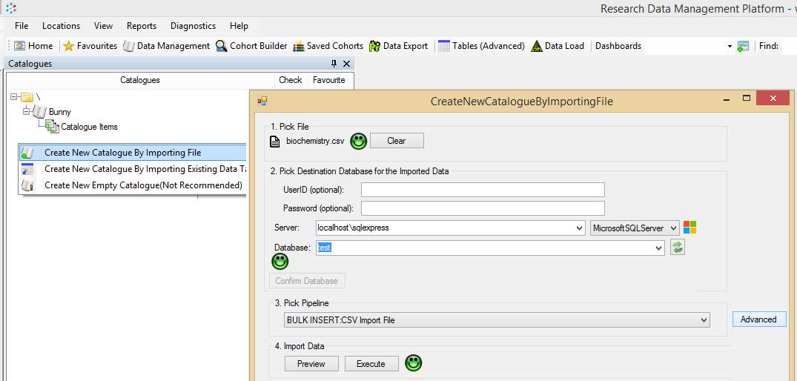
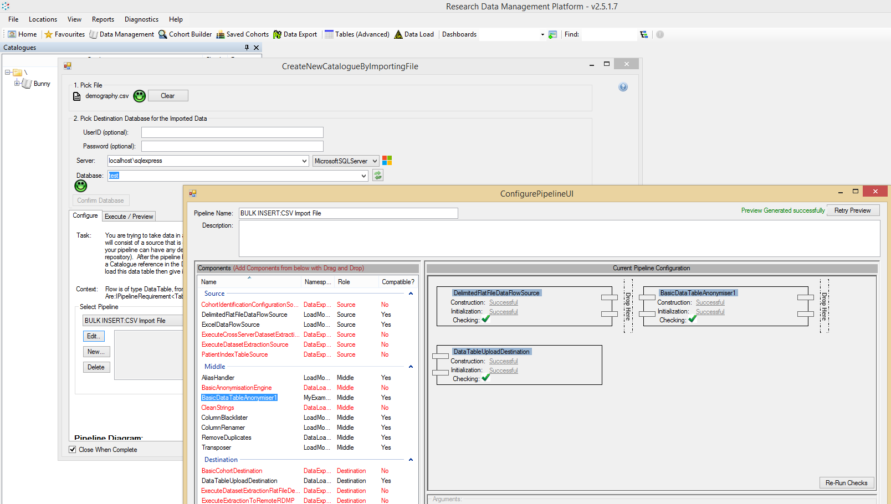

# Table of contents
1. [Hello World Plugin](#helloWorldPlugin)
1. [Attaching the Debugger](#debugging)
1. [Streamlining Build](#betterBuilding)
1. [Hello World UI Command Execution](#commandExecution)
1. [A basic anonymisation plugin](#basicAnoPlugin)

 <a name="helloWorldPlugin"></a>
 #Hello World Plugin
 Create a new Visual Studio Class Library Project targetting .Net Framework 4.5
 
 Add a reference to the HIC nuget server `https://hic.dundee.ac.uk/NuGet/nuget/` and add a reference to `HIC.RDMP.Plugin`
 
 Make sure that the major and minor version number (first two numbers) of the Nuget Package match your installed version of RDMP (Visible in the task bar of the main RDMP application)
 
 
 
 
 Add a class called `MyPluginUserInterface` and inherit from `PluginUserInterface` override `GetAdditionalRightClickMenuItems`
 
```csharp
 public override ToolStripMenuItem[] GetAdditionalRightClickMenuItems(object o)
        {
            if (o is Catalogue)
                return new[] { new ToolStripMenuItem("Hello World", null, (s, e) => MessageBox.Show("Hello World")) };

            return null;
        }
 ```

 Launch Research Data Management Platform main application and launch Plugin Management from the Home screen (under Advanced).  Select Add Plugin..
 
  
 
 Next add a new empty Catalogue
 
 
 
 Now right click it.  You should see your message appearing.
 
 
 
 <a name="debugging"></a>
 #Attaching the Debugger
 Sometimes you want to debug your plugin as it is running hosted by RDMP.  To do this simply launch `ResearchDataManagementPlatform.exe` manually (if you need to see where the exe is you can select Diagnostics=>Open exe directory at any time).  Next go into visual studio and select Debug=>Attach to Process
 
 <a name="betterBuilding"></a>
 #Streamlining Build
 There are a couple of things you can do to streamline your plugin development process.  Firstly You can remove the requirement to launch 'Manage Plugins' every time you make a code change by setting up a post build step which runs PluginPackager.exe.  This will commit the plugin into the RMDP database.  Secondly you can add the ResearchDataManagementPlatform.exe as a startup project in your plugin solution.

##Adding a post build script to commit the plugin 
 The executable responsible for commiting plugins is PluginPackager.exe, it should appear in your bin directory when you build your plugin.  
 
 Right click your Project and select Properties
 
 Enter a Post-build script to run PluginPackager.exe.  Make sure that you substitute your test server / database below: e.g.
 
```
$(TargetDir)PluginPackager.exe $(SolutionPath) $(SolutionName).zip -s localhost\sqlexpress -d RDMP_Catalogue

``` 

Now when you build your project (you may need to Clean and Rebuild) you should see the following:
```
  MyExamplePlugin -> E:\RDMP\Documentation\CodeTutorials\CodeExamples\MyExamplePlugin\bin\Debug\MyExamplePlugin.dll
  Found .csproj file reference at path: MyExamplePlugin\MyExamplePlugin.csproj
  SUCCESS: Found it at:E:\RDMP\Documentation\CodeTutorials\CodeExamples\MyExamplePlugin
  Your plugin targets CatalogueLibrary version 2.5.1.6
  Could not find dependent dll System.Drawing.dll
  Could not find dependent dll System.Windows.Forms.dll
  File MyExamplePlugin.dll uploaded as a new LoadModuleAssembly under plugin CodeExamples.zip
  File src.zip uploaded as a new LoadModuleAssembly under plugin CodeExamples.zip
```

(Do not worry about dependent dll messages)

##Adding a debug target
Right click your Solution and select 'Add Existing Project...' and navigate to the ResearchDataManagementPlatform.exe file.

This should add a new root level item in your Solution called 'ResearchDataManagementPlatform'

Right click it and set it as the startup project

Now when you start your plugin project the RDMP application will launch with the debugger attached.

<a name="commandExecution"></a>
#Hello World UI Command Execution
Rather than throwing around `ToolStripMenuItem` you can make use of the `CommandExecution` system.

Create a new class `ExecuteCommandRenameCatalogueToBunnies` inherit from base class `BasicUICommandExecution` and implement IAtomicCommand.

```csharp
   public class ExecuteCommandRenameCatalogueToBunnies:BasicUICommandExecution, IAtomicCommand
    {
        private readonly Catalogue _catalogue;

        public ExecuteCommandRenameCatalogueToBunnies(IActivateItems activator,Catalogue catalogue) : base(activator)
        {
            _catalogue = catalogue;

			if(catalogue.Name == "Bunny")
                SetImpossible("Catalogue is already called Bunny");
        }

        public Image GetImage(IIconProvider iconProvider)
        {
			//icon to use for the right click menu (return null if you don't want one)
            return Resources.Bunny;
        }

        public override void Execute()
        {
            base.Execute();

			//change the name
            _catalogue.Name = "Bunny";
			
			//save the change
            _catalogue.SaveToDatabase();

			//Lets the rest of the application know that a change has happened
            Publish(_catalogue);
        }
```

Adjust the plugin user interface class to return an instance of this new command:

```csharp
public class MyPluginUserInterface:PluginUserInterface
    {
        public MyPluginUserInterface(IActivateItems itemActivator) : base(itemActivator)
        {
        }
        
        public override ToolStripMenuItem[] GetAdditionalRightClickMenuItems(object o)
        {
            if (o is Catalogue)
                return new[]
                {
                    new ToolStripMenuItem("Hello World", null, (s, e) => MessageBox.Show("Hello World")),

                    GetMenuItem(new ExecuteCommandRenameCatalogueToBunnies(ItemActivator,(Catalogue)o))
                };

            return null;
        }

    }
```

Now when you right click a Catalogue you should see your command offered to the user:


<a name="basicAnoPlugin"></a>
#A (very) basic Anonymisation Plugin
Most of the processes in RDMP use the `Pipeline` system.  This involves a series of components performing operations on a flow of objects of type T (often a `DataTable`).  The pipeline is setup/tailored by RDMP users and then reused every time the task needs to be executed.  For example importing a csv file into the database and generating a Catalogue from the resulting table (the first thing you do when playing with the RDMP test data) happens through a pipeline called 'BULK INSERT:CSV Import File'.



In this tutorial we will write a reusable component which lets the user identify problem strings (names) in data they are importing.

Declare a new class `BasicDataTableAnonymiser1` and implement IPluginDataFlowComponent<DataTable>


```csharp
public class BasicDataTableAnonymiser1: IPluginDataFlowComponent<DataTable>
{
	private static readonly string[] CommonNames = { "Thomas", "Wallace", "Young" };

	public DataTable ProcessPipelineData(DataTable toProcess, IDataLoadEventListener listener,GracefulCancellationToken cancellationToken)
	{
		//Go through each row in the table
		foreach (DataRow row in toProcess.Rows)
		{
			//for each cell in current row
			for (int i = 0; i < row.ItemArray.Length; i++)
			{
				//if it is a string
				var stringValue = row[i] as string;

				if(stringValue != null)
				{
					//replace any common names with REDACTED
					foreach (var name in CommonNames)
						stringValue =  Regex.Replace(stringValue, name, "REDACTED",RegexOptions.IgnoreCase);

					row[i] = stringValue;
				}
			}
		}

		return toProcess;
	}

	public void Dispose(IDataLoadEventListener listener, Exception pipelineFailureExceptionIfAny)
	{
		
	}

	public void Abort(IDataLoadEventListener listener)
	{
		
	}

	public void Check(ICheckNotifier notifier)
	{
		
	}
}
```

Select 'demography.csv' for import (See UserManual.docx for generating test data).  Choose a database as the destination and select 'Advanced'.  Select the `BULK INSERT:CSV Import File` pipeline and click Edit.



Drag and drop BasicDataTableAnonymiser1 into the middle of the pipeline.

Execute the import and do a select out of the final table to confirm that it has worked:

```sql
select * from test..demography where forename like '%REDACTED%'
```