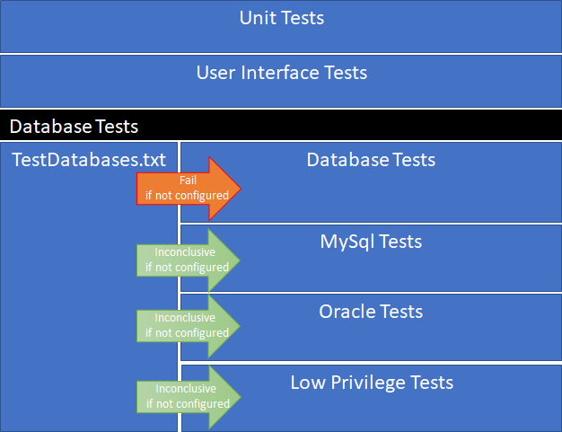

# RDMP Code Tests
## Background
Code testing is vital for ensuring the long term stability of a codebase.  Proper testing of RDMP requires an Sql Server instance for storing platform metadata objects (`Catalogue`, `Project` etc) as well as creating test tables/databases.  RDMP tests are therefore divided into those that test basic assumptions (unit tests) and those that test system functionality in place (`DatabaseTests`).  

RDMP is designed to manage research datasets stored in several formats (Sql Server, MySql, Oracle).  Cross platform tests or test cases can be run when suitable testing server instances are available.

 

## Running Tests
Before running DatabaseTests you should run DatabaseCreation.exe with appropriate parameters

For example if you have a local sql server express instance on your development PC you can run 
```
cd .\Tools\DatabaseCreation\bin\Debug\
DatabaseCreation.exe localhost\sqlexpress TEST_ -D
```

If you need to change the server name or database prefix from the above example then before running the integration tests you will have to update ".\Tests.Common\DatabaseTests.txt" to have a matching servername and prefix.

__WARNING__:DatabaseTests will delete the contents of the TEST_ databases before each test is run and some will create temporary databases/tables during runtime, therefore it is important that you do not use a production server for integration testing

If you have an testing environment with an Oracle and\or MySql server instance then you can enable running these tests too by entering the connection strings into `DatabaseTests.txt`.  If you do not define a connection string then these tests will be marked `Inconclusive` when run.

## Writing New DatabaseTests
If you require to scratch tables or platform objects then you should inherit from `DatabaseTests`

```csharp
public class MyTests : DatabaseTests
{
	[Test]
	public void Test1()
	{
		var cata = new Catalogue(CatalogueRepository,"My Test Cata");
		Assert.IsTrue(cata.Exists());
	}
}
```

If you want to run your test against multiple database types (Oracle / MySql etc) then the preferred method is to use a `TestCase` and call `GetCleanedServer` to obtain a cross platform object that represents the scratch database.

```csharp
public class MyTests : DatabaseTests
{
	[TestCase(DatabaseType.MicrosoftSQLServer)]
	[TestCase(DatabaseType.Oracle)]
	[TestCase(DatabaseType.MYSQLServer)]
	public void Test2(DatabaseType type)
	{
		var database = GetCleanedServer(type);
		
		Assert.IsTrue(database.Exists());
		Assert.IsEmpty(database.DiscoverTables(true));
		Assert.IsNotNull(database.GetRuntimeName());
	}
}
```

If you want to test a system running under a database user account with limited access rights you can use `DatabaseTests.SetupLowPrivelegeUserRightsFor`.  You will have to create the user account yourself and configure connect etc priveleges.


```csharp
public class MyTests : DatabaseTests
{
	[TestCase(DatabaseType.MicrosoftSQLServer)]
	[TestCase(DatabaseType.Oracle)]
	[TestCase(DatabaseType.MYSQLServer)]
	public void TestReadDataLowPriveleges(DatabaseType type)
	{
		var database = GetCleanedServer(type);

		//create a table on the server
		var dt = new DataTable();
		dt.Columns.Add("MyCol");
		dt.Rows.Add("Hi");
		dt.PrimaryKey = new[] {dt.Columns[0]};

		var tbl = database.CreateTable("MyTable", dt);

		//at this point we are reading it with the credentials setup by GetCleanedServer
		Assert.AreEqual(1, tbl.GetRowCount());
		Assert.AreEqual(1, tbl.DiscoverColumns().Count());
		Assert.IsTrue(tbl.DiscoverColumn("MyCol").IsPrimaryKey);

		//create a reference to the table in RMDP
		TableInfo tableInfo;
		ColumnInfo[] columnInfos;
		Import(tbl, out tableInfo, out columnInfos);

		//setup credentials for the table in RDMP (this will be Inconclusive if you have not enabled it in TestDatabases.txt
		SetupLowPrivelegeUserRightsFor(tableInfo);

		//request access to the database using DataLoad context
		var newDatabase = DataAccessPortal.GetInstance().ExpectDatabase(tableInfo, DataAccessContext.DataLoad);

		//get new reference to the table
		var newTbl = newDatabase.ExpectTable(tableInfo.GetRuntimeName());

		//the credentials should be different
		Assert.AreNotEqual(tbl.Database.Server.ExplicitUsernameIfAny, newTbl.Database.Server.ExplicitUsernameIfAny);
		
		//try re-reading the data 
		Assert.AreEqual(1, newTbl.GetRowCount());
		Assert.AreEqual(1, newTbl.DiscoverColumns().Count());
		Assert.IsTrue(newTbl.DiscoverColumn("MyCol").IsPrimaryKey);

		//low priority user shouldn't be able to drop tables
		Assert.That(newTbl.Drop,Throws.Exception.TypeOf<Exception>());

		//normal testing user should be able to
		tbl.Drop();
	}
}
```