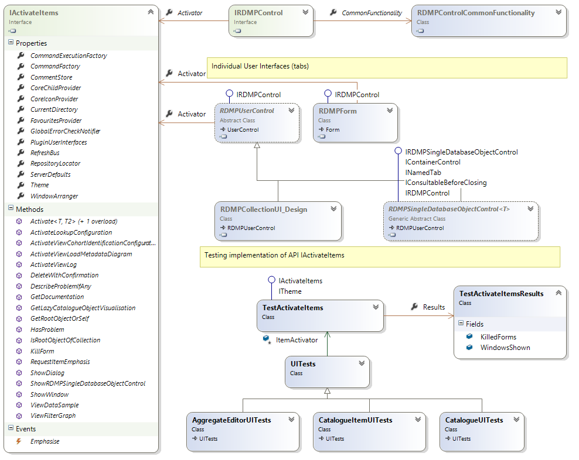

# User Interface Overview

## Background

RDMP is a large application with many complicated user interfaces.  In order to manage these a strict architecture has been built.  This architecture is bult around a single base class `IRDMPControl` for all top level controls.  This interface provides access to the UI API `IActivateItems`.  Unit testing of UIs is supported via `TestActivateItems`.
 

## Collections

`RDMPCollectionUI` is responsible for hosting tree views depicting all objects associated with a given area of the program (Extraction,Cohort Building, Loading etc).  There can only be one instance of any given `RDMPCollectionUI` at once (like the Solution Explorer in Visual Studio).

All the logic for how these controls operate is defined in `RDMPCollectionCommonFunctionality`.  The hierarchy of objects is determined up front by `ICoreChildProvider`.  The hierarchy is updated whenever any [Publish](#publishing) occurs.

## Single Object Control Tabs

## Publishing
The `RefreshBus` is responsible for updating all UI components with the latest state of objects.  This is instigated whenever `RefreshBus.Publish` is called by a UI.  The sequence of events is:

1. `ICoreChildProvider` updated (fetches all new objects from the repository)
2. BeforePublish event called
3. All `IRefreshBusSubscriber` are notified

Typical behaviours exhibited by subscribers include closing (if the object has been deleted) or updating the displayed contents based on the new state of the object.

Subscribers should never attempt a new Publish while responding to a Publish callback (this will trigger a `SubscriptionException`).

Since the Equality comparer of `DatabaseEntity` considers only the `ID` and `Repository` newly published objects do not break Dictionaries / HashSets etc.  This is very important since [most UI tabs are tied to a specific single object](#single-object-control-tabs).

## Double Clicking

## Drag and Drop

## Menus

